# User Guide

A human-in-the-loop cell classifier for QuPath 0.7. The extension trains two ML models in parallel (XGBoost + LightGBM by default) and uses their **disagreement** to surface the cells that need your attention. Everything runs in-process.

Please note that function speed is dependent on hardware and size of project during analysis. Windows and tasks may take a moment to appear or start running especially with larger projects and images, **please be patient**.

Windows and boxes can be expanded or contracted by clicking and dragging corners which will display buttons correctly. You will see an arrow appear if you are mousing over the correct spot on the window.

> **Conventions in this guide**
> - **Bold** = exact UI label.
> - `Monospace` = file path or code.
> - "Multi-class mode" = the standard sidebar (any number of cell-type classes).
> - "Binary mode" = a per-marker positive/negative classifier (CD4+/CD4−, etc.).
> - Add your own screenshots next to each section heading after install.

---

## Table of Contents

1. [Install & launch](#1-install--launch)
2. [Quick start — multi-class workflow](#2-quick-start--multi-class-workflow)
3. [Quick start — binary + composite workflow](#3-quick-start--binary--composite-workflow)
4. [Setup steps (shared by both workflows)](#4-setup-steps-shared-by-both-workflows)
   - [4.1 Select features](#41-select-features)
   - [4.2 Clustering normalisation](#42-clustering-normalisation)
   - [4.3 Create classes & Class Control](#43-create-classes--class-control)
   - [4.4 Import a marker table (auto channel switching)](#44-import-a-marker-table-auto-channel-switching)
5. [Multi-class workflow in detail](#5-multi-class-workflow-in-detail)
6. [Binary + composite workflow in detail](#6-binary--composite-workflow-in-detail)
7. [After training — Review mode](#7-after-training--review-mode)
8. [Project Prediction Summary](#8-project-prediction-summary)
9. [Intensity heatmaps](#9-intensity-heatmaps)
10. [Distance measurements (spatial analysis)](#10-distance-measurements-spatial-analysis)
11. [Cell scatter plot — clustering & gating](#11-cell-scatter-plot--clustering--gating)
    - [11.1 Controls](#111-controls)
    - [11.2 Selecting cells](#112-selecting-cells)
    - [11.3 Apply Clusters — assign classes to clusters](#113-apply-clusters--assign-classes-to-clusters)
    - [11.4 Cluster-within-clusters (hierarchical gating)](#114-cluster-within-clusters-hierarchical-gating)
    - [11.5 Project-wide clustering across images](#115-project-wide-clustering-across-images)
    - [11.6 Clustering method: k-means vs Leiden](#116-clustering-method-k-means-vs-leiden)
12. [Exporting results](#12-exporting-results)
    - [12.1 Cell table export](#121-cell-table-export)
    - [12.2 Ground truth export & import](#122-ground-truth-export--import)
13. [Utility scripts](#13-utility-scripts)
    - [13.1 Filter Cells by Size & Circularity](#131-filter-cells-by-size--circularity)
    - [13.2 Resolve Hierarchy](#132-resolve-hierarchy)
    - [13.3 Delete Measurements by Keyword](#133-delete-measurements-by-keyword)
    - [13.4 Import GeoJSON Objects](#134-import-geojson-objects)
    - [13.5 Export Annotation Regions](#135-export-annotation-regions)
    - [13.6 Reset CellTune Project State](#136-reset-celltune-project-state)
14. [Reference: every setting in the sidebar](#14-reference-every-setting-in-the-sidebar)
15. [Reference: every CellTune menu item](#15-reference-every-celltune-menu-item)
16. [Project directory layout](#16-project-directory-layout)
17. [Image pixel prescreen (whole-image QC)](#17-image-pixel-prescreen-whole-image-qc-no-cells-needed)
18. [Cellular neighborhoods (spatial micro-environments)](#18-cellular-neighborhoods-spatial-micro-environments)
    - [18.1 When to use it](#181-when-to-use-it)
    - [18.2 How the clusters are computed](#182-how-the-clusters-are-computed)
    - [18.3 Scope: current image vs whole project](#183-scope-current-image-vs-whole-project)
    - [18.4 Running it — step by step](#184-running-it--step-by-step)
    - [18.5 The enrichment heatmap — reading, naming, merging](#185-the-enrichment-heatmap--reading-naming-merging)
    - [18.6 Parallel workers (project scope) — performance](#186-parallel-workers-project-scope--performance)
    - [18.7 Viewer overlays](#187-viewer-overlays)
    - [18.8 Tips & cautions](#188-tips--cautions)
19. [Tips, tricks and known limitations](#19-tips-tricks-and-known-limitations)

---

## 1. Install & launch

1. **Download** `qupath-extension-celltune-0.2.2-all.jar` from the [Releases page](https://github.com/mikemcka/qupath_extension_celltune/releases), or build it from source — see [CLAUDE.md](CLAUDE.md#build--test).
2. Drop the JAR into QuPath's `extensions/` folder, or drag-and-drop it onto the running QuPath window.
3. Restart QuPath. The **CellTune Classifier** panel docks into the analysis tab pane on the right, you can mouse over the area and scroll the mouse wheel to uncover it.
4. Some commands also live under the **Extensions → CellTune Classifier** menu.

Disable the extension at any time from **Edit → Preferences → CellTune Classifier → Enable**.

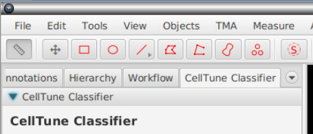

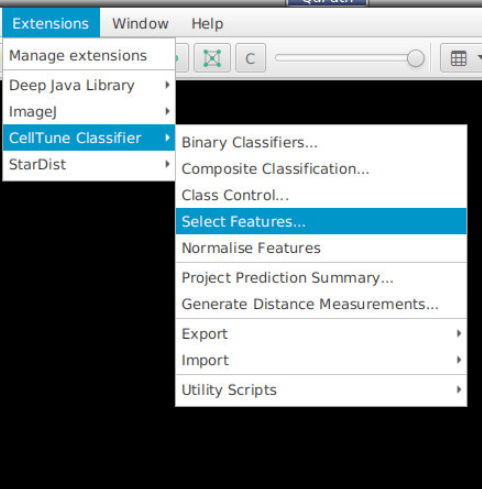

---

## 2. Quick start — multi-class workflow

Build one classifier that distinguishes any number of cell types (e.g. T-cell / B-cell / Macrophage / Tumour / Stroma).

```
Select Features  →  Clustering Normalisation  →  Create classes (Class Control)
       ↓
Import Marker Table (optional, for auto channel switching)
       ↓
Manual Label Mode  → label ~20–50 cells across the open image
       ↓
Apply to which images... → choose images to predict on
       ↓
Set Workers, pick settings (Pool labels, Balancing, Early stopping, etc.)
       ↓
Train  →  inspect Training Metrics + Confusion Matrix
       ↓
Enter Review Mode  →  correct cells the models disagree on
       ↓
(repeat: more labels → Train → Review)
       ↓
Project Prediction Summary  →  flag outlier slides → re-label as needed
       ↓
Export Cell Table  or  Export Ground Truth
```

Detail per step is in §[4](#4-setup-steps-shared-by-both-workflows), §[5](#5-multi-class-workflow-in-detail), §[7](#7-after-training--review-mode).

---

## 3. Quick start — binary + composite workflow

Build one **positive/negative classifier per marker** (CD3, CD4, CD8, CD20…), then combine them into composite cell types (`CD3+:CD4+:CD8-`, etc.).

```
Select Features  →  Clustering Normalisation
       ↓
Binary Classifiers... → Create "CD3" → Open (enters Binary Mode)
       ↓
Manual Label Mode → label CD3-positive vs CD3-negative cells
       ↓
Apply to which images... → Train → Review Mode (correct disagreements)
       ↓
Exit Binary Mode → repeat for CD4, CD8, CD20, etc.
       ↓
Composite Classification... → tick markers, tick images
       ↓
(optional) tick "Prepend current primary classification" to keep
multiclass colouring
       ↓
Apply → composite labels appear in viewer (Tumour:CD3+:CD8-, …)
       ↓
Export Cell Table
```

Detail per step is in §[6](#6-binary--composite-workflow-in-detail).

---

## 4. Setup steps (shared by both workflows)

### 4.1 Select features

**Menu:** *Extensions → CellTune Classifier → Select Features...*

QuPath cell-detection panels (COMET, MIBI, IMC, CODEX) often produce 1000–2000 measurement columns per cell. The extension lets you pick a subset for training; the rest are ignored.

- **Search** box — case-insensitive substring filter (matching groups auto-expand).
- **Grouped checkbox tree** — features are bucketed into collapsible groups (below); tick a group's parent box to select/clear every feature in it at once.
- **Select All** / **Clear All** — operate on whatever's currently visible after filtering. Great for removing large groups of features.
- **Expand All** / **Collapse All** — open or close every group.
- Checkbox per row to toggle individual features.
- Counter at the bottom: `X / Y selected`.

Features are grouped so large panels stay navigable — one group per **marker** (the text before the first `: `, e.g. `DAPI_AF`), then catch-all groups in this order:

- **Morphology / Shape** — compartment-only measurements (`Cell: Area µm^2`, `Nucleus: Circularity`, …).
- **Neighbors** — neighbour-aggregate features (`Neighbors: Mean: …`); labels keep the `Neighbors:` prefix so the context isn't lost.
- **Embeddings** — dimensionality-reduction / embedding columns: UMAP, PCA, t-SNE, and `*_emb_*`-style names (e.g. `kronos_emb_0`).
- **Other / Uncategorized** — anything matching none of the above, so nothing is silently misfiled into Morphology.

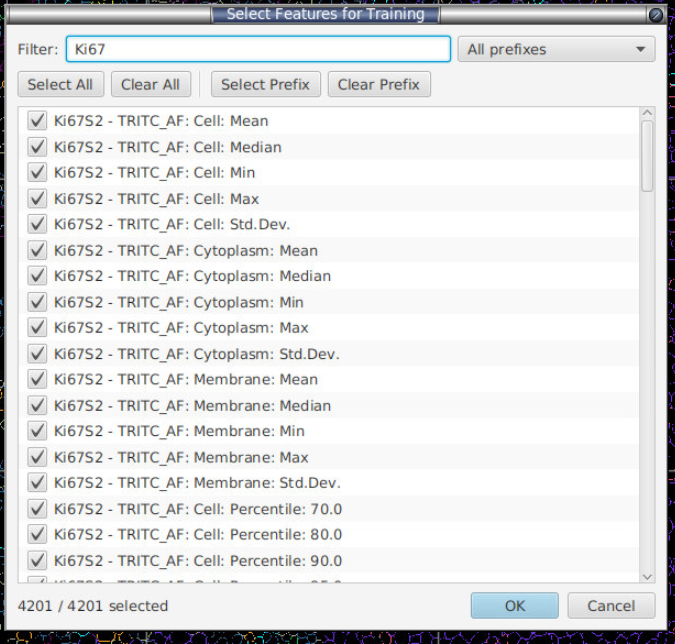

**Do you need to hand-prune for big panels?** Usually not. Both default models are gradient-boosted trees, which are robust to correlated and redundant features: at each split a tree picks the single most informative feature, so two near-duplicate columns don't distort the model the way they would in a linear/regression model — the worst case is wasted training time and *diluted* importance (a marker's signal gets split across its correlated columns, muddying SHAP plots). So extra features rarely hurt accuracy, but they do cost speed and interpretability.

Rather than manually paring the list down, leave **Auto-prune features** (§[14](#14-reference-every-setting-in-the-sidebar)) ticked — it removes the redundancy for you, non-destructively, at the start of every training round. Pruning runs on the **pooled, normalised training matrix**: your labelled cells *plus* the cells pooled from every other project image, after normalisation — so a feature is judged on the whole training cohort, not the open image alone. (Imported CSV rows are normalised and trained on, but are **excluded** from the prune decision, since their panel may be partial.) The stages are:

1. **Sparsity / variance filter** — drops features that are effectively constant across the pooled set (non-zero in fewer than ~5 cells, or zero variance). A feature that never varies can't help a tree split.
2. **Within-marker correlation removal** — features are grouped (see *What defines a group* below); within each group it keeps the **highest-variance** feature and drops any peer whose absolute Pearson correlation with a kept feature exceeds ~0.95. This is what collapses `CD3: Cell: Mean` / `CD3: Cell: Median` / `CD3: Cell: Max` down to one representative column.
3. **Cross-marker correlation removal** — available but **off by default**, so distinct markers are never merged just because they happen to co-vary.
4. **Per-group whitelist (top 5)** — the **5 highest-variance features in every group are always kept**, immune to the stages above. A group with 5 or fewer features keeps *all* of them. So the classifier never goes blind to a marker, and each marker retains its strongest few features even when they correlate.

> **What defines a "group" for pruning?** The group key is the text before the first `: ` (so `CD3: Cell: Mean` → `cd3`); if the name has no `: `, it's the token before the first underscore or space (so `kronos_emb_0` → `kronos`, `Distance to tumor` → `distance`). Matching is **case-insensitive** (`CD3` and `cd3` are one group). This pruning grouping is deliberately *separate* from the feature-picker categories above (Morphology / Neighbors / Embeddings) — those exist to navigate the UI; this one defines redundancy families for pruning.

Pruning takes milliseconds and **never touches the measurements on disk** — it only trims the training column list for that run. The net effect is the same "near-identical accuracy, much faster training, cleaner SHAP plots" you'd get from hand-restricting to `Cell: Mean` only, without you having to guess which columns to keep.

Your selection is saved in `<project>/celltune/classifier-state.json` and persists across QuPath sessions.

### 4.2 Clustering normalisation

**Menu:** *Extensions → CellTune Classifier → Clustering Normalisation*

Per-feature transforms for the **clustering / scatter-plot / gating** workflows. **The classifier always trains and predicts on raw values** — normalisation configured here does not touch the phenotyping model (tree models are invariant to it anyway). Same prefix/search/select-all UI as Select Features, plus:

- **Transform** dropdown:
  - **arcsinh** — `arcsinh(x / cofactor)`. Recommended default.
    - **Fluorescence (COMET, CODEX, IF)** — scale-dependent, so there is no single right number. For **raw 16-bit-style panels** (values in the hundreds–thousands, e.g. a raw COMET panel) a cofactor in the **tens (~25–50)** fits well; ~1 suits only already-normalised / low-range intensities, and a large value (e.g. 150) leaves the dim markers essentially untransformed.
    - **MIBI mass spectrometry** — **cofactor = 0.05**, the community-standard value from Hartmann et al. (2021) / the squidpy MIBI-TOF tutorial, applied to per-cell mean intensities (see [References](README.md#references)).
    - **The ideal cofactor tracks your data's intensity scale** — pick it near the background/signal boundary. Quick check: if almost every cell's raw value is *below* the cofactor, nearly all cells sit in the near-linear part of arcsinh and the transform is ≈ a no-op (e.g. cofactor 1 on MIBI means that mostly fall below 1, or 150 on dim fluorescence markers). If almost every value is *far above* it, everything is log-compressed and the low-end detail is lost. Aim for the value where the background collapses but the positive population stays resolved, and eyeball the transformed histogram to confirm.
  - **sqrt** — `sqrt(max(0, x))`. Simple variance stabilisation, no cofactor.

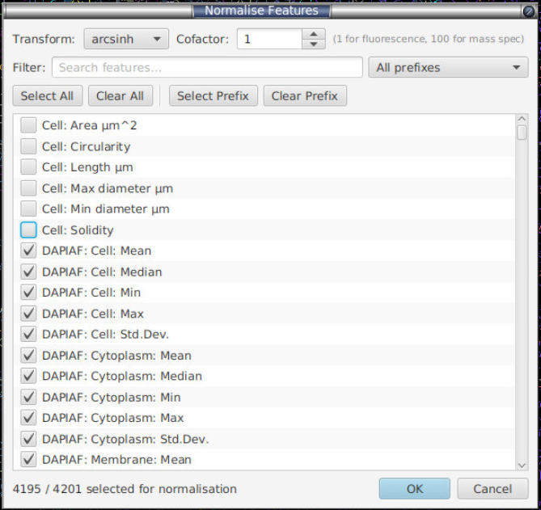

You pick **which** features to transform and **one** transform/cofactor applied to all of them. Untouched features stay raw.

**Do not** normalise morphological features like Cell Area or any pre-normalised features like foundation model embeddings.

**What it's for — scale-dependent methods (clustering), not the classifier.** `arcsinh(x / cofactor)` is a monotone, per-feature squash: near-linear below the cofactor, log-compressed above it, so it flattens bright outliers while preserving the dim/low-intensity detail. Its job is to stop a few high-dynamic-range markers from dominating **Euclidean distance / kNN** in the workflows that measure distances between cells — the **scatter-plot clustering** (k-means and Leiden, §[11](#11-cell-scatter-plot--clustering--gating)), the PCA embedding, gating thresholds, and the colour-by-marker views. There it is essential: raw 16-bit intensities left untransformed make clustering track whichever markers happen to be brightest instead of the whole phenotype.

Two things it does **not** do:

- **It never touches the classifier.** The phenotyping model always trains and predicts on **raw** values — normalisation is applied only in the clustering path. (Even if it were applied, XGBoost / LightGBM / Random Forest split on rank order and arcsinh is a strictly increasing rescale, so predictions would be unchanged at any cofactor.) Auto-prune, feature-importance/SHAP, and ground-truth export all operate on the same raw values the model sees; export no longer writes `__norm` columns.
- **It does not correct slide-to-slide (batch) differences, so it does not improve generalisation to unseen slides.** The same global transform is applied identically to every image, so it uses no per-image information and cannot remove per-slide staining/exposure offsets. Generalising across variable samples is a **batch-correction** problem (per-image or reference-based alignment) plus annotating a **diversity** of slides — not something arcsinh addresses.

**What this pane configures vs. what clustering always does.** The arcsinh/sqrt transform here is only **stage 1** of the clustering normalisation, and it is **optional** — leave it off and clustering still runs. The full pipeline every clustering fit applies is:

```
(optional arcsinh / sqrt)  →  z-score per marker  [always]  →  (PCA if >50 markers)  →  k-means / Leiden
     stage 1 — this pane            stage 2 — automatic            dim-reduction — automatic
```

- **Stage 2 — z-score is mandatory and automatic.** Every clustering fit standardises each marker (subtract mean, divide by SD) over the active/pooled cells at fit time. This is what actually puts markers on a comparable scale so no single one dominates Euclidean distance — it happens **whether or not** you configure a transform here.
- **Dimensionality reduction is automatic and conditional.** When more than ~50 marker columns are active (and the *Reduce dims (PCA)* option is on, the default), an exact PCA is applied after z-scoring, mirroring the scanpy `scale → PCA → neighbours → Leiden` recipe. Below that threshold, or with PCA off, it's skipped.

So configuring arcsinh here is the optional stage-1 *dynamic-range compressor* that runs **before** the always-on z-score — it additionally tames within-marker skew and bright-pixel outliers that z-scoring alone can't (z-score is a linear rescale and leaves a skewed marker's outliers as extreme values). If you configure nothing, clustering uses z-score (+ conditional PCA) on the raw values.

### 4.3 Create classes & Class Control

**Menu:** *Extensions → CellTune Classifier → Class Control...*

A 4-tab dialog for managing the QuPath class panel **and** the labels saved on disk under `<project>/celltune/image-labels/`.

#### Add tab
Type a class name, click **Add Class**. Just adds it to QuPath's class panel — no label files touched.

#### Delete tab
- Pick a class from the list.
- Tick **Also remove labels with this class from all image-label files** to scrub it from every saved per-image label JSON. Leave unticked to only remove it from the class panel (labels stay on disk, invisible).
- **Delete Selected Class** (red) — asks for confirmation.

#### Merge tab
- Multi-select source classes (Ctrl/Cmd+click), then either type a target name or pick one from **Existing**.
- **Merge Selected → Target** rewrites every matching label across all images. The original name is preserved inside the label string: `test1` merged into `myType` is stored on disk as `test1-mergedInto(myType)`. Training sees only the effective class (`myType`); the audit trail makes the merge fully reversible.

#### Undo Merge tab
- Pick a class that was previously the merge target (the combo scans label files for `-mergedInto(...)` patterns).
- **Undo Merge for Selected Class** — restores every label to its original name and re-adds the source `PathClass` to QuPath's class panel. The target class is **not** deleted; you can drop it from the Delete tab if you no longer want it.

### 4.4 Import a marker table (auto channel switching)

**Menu:** *Extensions → CellTune Classifier → Import ▸ Marker Table...*

Optional. Maps cell types to marker channels so review mode can auto-switch channel visibility to the markers relevant to each predicted cell.

**Simple format:**

```csv
CellType,Marker1,Marker2,Marker3
T-Cell,CD3,,
B-Cell,CD20,,
Macrophage,CD68,CD163,
Dendritic,CD11c,,
NK-Cell,CD56,,
```

Channel-name matching is robust (alphanumeric-normalised), so `CD3_S2 - Cy5_AF` matches the channel `CD3_S2-Cy5_AF` automatically.

In review mode, ticking the **Auto-select channels during review** checkbox makes QuPath show only the relevant markers for the cell currently under review. Untick it to navigate channels manually. A second, smaller tick-box — **Auto-adjust brightness/contrast of shown channels** — is **off by default**: tick it if you also want each shown channel's display range (brightness/contrast) re-adjusted automatically each time you move to a new cell. Left unticked, only channel *visibility* switches and your own brightness/contrast settings are preserved. (It only takes effect while auto-select is on, so it is greyed out otherwise.)

> The marker table is saved to `<project>/celltune/marker-table.json` when you import it, so it persists across QuPath restarts — no need to re-import. Importing a new CSV overwrites it.

---

## 5. Multi-class workflow in detail

### 5.1 Initial manual labelling

Click **Manual Label Mode** in the sidebar. A floating toolbar appears:

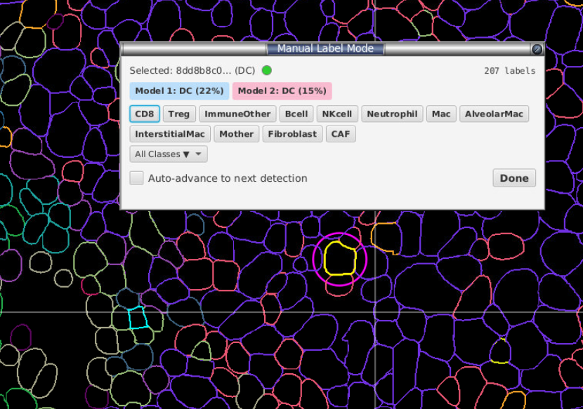

- Click a cell in the QuPath viewer → its ID and current class show at the top, the status dot turns lime if labelled, white if not.
- A **magenta ring** marks the selected cell (a lightweight overlay — won't slow down 50k+ cell images).
- Up to 12 quick-access class buttons appear inline; the rest live under **All Classes ▼**.
- **Auto-advance to next detection** — when ticked, assigning a label automatically jumps to the next cell.

**How many to label?** Aim for **at least 20–30 cells per class** before your first training run. The extension will refuse to train with fewer than 10 labelled cells total. You can — and should — add more after each review cycle.

> The **Model 1** / **Model 2** buttons only appear once you've trained at least once. They let you accept a prediction with one click. Background colour: blue = M1, pink = M2.

### 5.2 Choose images to apply the classifier to

Click **Apply to which images... (N)** above the train button.

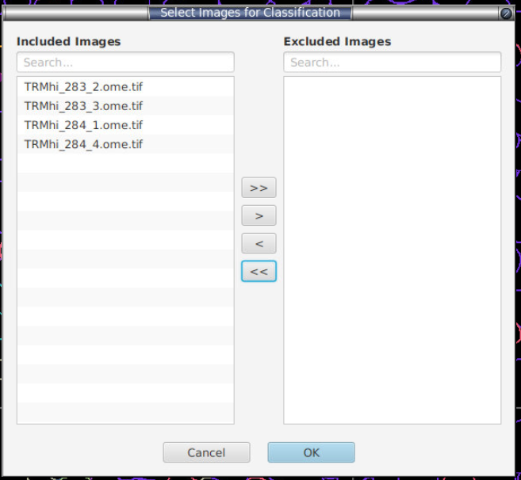

- Dual-list selector. Left = images the classifier will predict on, right = excluded.
- Per-list search and Move-all/Move-selected arrows.
- The **currently open image is always included** and can't be moved out.
- Click **OK**; the button label now shows the count, e.g. `Apply to which images... (12)`.

This is a quick way to reduce prediction times but only focusing on one or a few images.

### 5.3 Crank up workers (if you have RAM)

**Workers** spinner (1–8). One worker = one full slide loaded into memory at a time. On a 32 GB workstation with COMET-sized slides, 2–3 workers is a sweet spot. On 16 GB, leave at 1.

### 5.4 Pick the right settings

The defaults are tuned for typical multiplex panels. Adjust as follows:

| Setting | Default | Turn ON when… | Turn OFF when… |
|---|---|---|---|
| **Pool labels from all images** | ✅ | (always; auto-on in binary mode) | training a per-image model intentionally |
| **Enable data balancing** + `SMOTE + Tomek` | ✅ | one class << others (typical multiplex) | classes are already balanced or you want raw counts |
| **Auto-tune hyperparameters** | ❌ | first/Last build of a new panel; willing to wait | iterating fast; defaults known to work |
| **Early stopping** | ✅ | (always — no downside) | reproducing a paper with a fixed round count |
| **Show top 10 feature importance** | ✅ | (always — cheap) | reducing UI clutter |
| **Auto-prune features** | ✅ | (always — non-destructive, faster training) | running a reproducible benchmark |
| **Restrict to features shared with imported data** | ❌ | merging labels imported from a different panel | training on this project only |
| **Sample current image only** | ❌ | drilling into one tricky FOV | (default — covers whole project) |

**Resampling strategies** (visible when Enable data balancing is on):

**Leave as default if you don't understand this** This is complicated and involves generating synthetic data or removing datapoints from a feature set which will vary as your training dataset changes over time.

| Strategy | Effect |
|---|---|
| `NONE` | No resampling |
| `SMOTE` | Synthetic minority oversampling (k=5 nearest same-class neighbours) |
| `ADASYN` | Like SMOTE but concentrates synthetics on hard-to-classify minorities |
| `TOMEK` | Removes majority-class members of mutual nearest-neighbour pairs (cleans boundary) |
| `SMOTE + Tomek` (default) | SMOTE, then Tomek cleanup |
| `ADASYN + Tomek` | ADASYN, then Tomek cleanup |

Defaults work for ~90% of cases. Switch to `SMOTE` alone if Tomek is removing too much real signal; switch to `ADASYN` if a minority class lives in a hard region of feature space.

**Models 1 & 2.** Default pair is **XGBoost + LightGBM**. Random Forest is also available. Keep the two model types **different** — that's the whole point of dual-model disagreement. Auto-tune runs independently per model. Both boosted models (XGBoost, LightGBM) attempt **GPU (CUDA)** training automatically and fall back to CPU if no compatible GPU is present; the training progress dialog reports the device actually used.

**Rounds / Max depth.** Default 200 rounds, depth 6. Together with early stopping, this is almost always enough. Increase rounds to 500 if early stopping is firing very late.

### 5.5 Train

Click **Train**. A progress dialog shows the current step (feature extraction, balancing, fold training, etc.). Before training starts, a timestamped backup of the label store is written to `<project>/celltune/labels_backup_*.json`. You will receive a notification if you have insufficient memory for training at this time.

Status bar after success: `Training complete — 523 cells classified, 47 disagreements.`

### 5.6 Inspecting the result

Two views are unlocked after a successful run:

#### Confusion Matrix (button)

The **inter-model agreement** matrix — rows = XGBoost prediction, columns = LightGBM prediction.

- **Diagonal cells (blue)** — both models agreed on this class.
- **Off-diagonal cells (orange/red)** — the two models disagreed; these are the cells that go into Review Mode.
- **Right column** — per-class recall-style %.
- **Bottom row** — per-class precision-style %.
- **Far right** — per-class Dice (inter-model F1).
- **Summary line:** `Total: X | Agreement: Y (Z%) | Disagreement: A (B%) | Macro Dice: D`.

A diagonal-dominant matrix means the two models broadly agree; large off-diagonal hotspots show systematic confusion pairs (e.g. CD4/CD8 cross-talk) — those are your priority for the next labelling round.

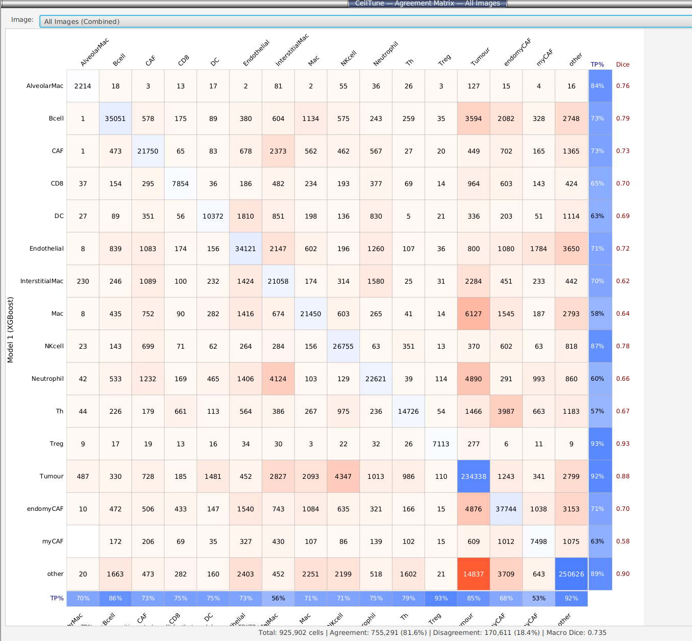

#### Training Metrics (button)

Per-class **precision / recall / F1 / support** for each model, computed on a held-out **20% stratified validation split**:

```
class            precision   recall      f1   support
─────────────────────────────────────────────────────
CD4                  0.925    0.887    0.906       145
CD8                  0.891    0.923    0.907       198
…
─────────────────────────────────────────────────────
accuracy                              0.905       500
macro F1                              0.894       500
weighted F1                           0.903       500
```

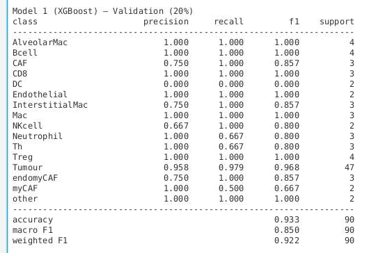

There's also a **Validation Confusion Matrix** view (true class × predicted class on the same 20% fold), with both absolute counts and row-normalised recall heatmaps, plus a per-row diagonal = recall.

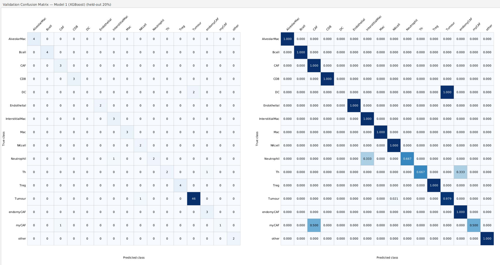

**Exports:**
- **CSV** — long format `split,model,class,precision,recall,f1,support`, with summary rows tagged `__accuracy__`, `__macro_f1__`, `__weighted_f1__` so they're easy to filter in pandas/R.
- **PNG** — side-by-side validation confusion-matrix heatmaps.

> **Don't trust an F1 of 0.95 on its own.** A 20% stratified split from the same image (or even from a tight cluster of similar images) overstates how well the model will generalise. The honest test is: **open a different slide, predict, and visually scan the results**, then check the Project Prediction Summary (§8). If a slide has predictions that look wrong by eye, the F1 lied — go label some of its cells.

#### Feature Importance (button)

Top-N (up to 10) features by **mean |SHAP|** per class. Horizontal bars, one colour per class, dropdown to switch classes. SHAP is averaged across whichever models are active (TreeSHAP for XGBoost/LightGBM, normalised split counts for Random Forest).

Use it to spot features the model is over-relying on (e.g. if `Cell: DAPI Mean` dominates every class, it probably shouldn't be in the feature set — de-select it in Select Features, §[4.1](#41-select-features); note that changing the arcsinh cofactor won't fix this, since the tree models are invariant to that monotone transform). It's also where a stray feature you forgot to de-select in Select Features (§4.1) tends to show up — a non-biological column like a cell index or centroid coordinate ranking near the top is a red flag that it leaked into training.

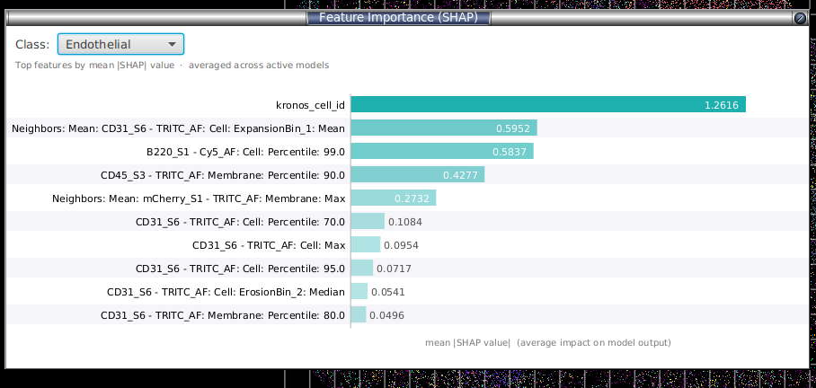

Here `kronos_cell_id` (a cell index) dominates the SHAP ranking — a clear sign it leaked into training and should be de-selected in Select Features.

### 5.7 Optional — restrict sampling to specific annotations

Two controls above the buttons:

- **Sample current image only** — limits review/sampling to the open image.
- **Filter by annotation keywords** — comma-separated, case-insensitive substring match against annotation names. Example: `Tumour, Margin` → only cells whose centroid falls inside an annotation whose name contains "Tumour" or "Margin" are eligible.

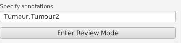

Leave both blank to sample across every cell in every project image (recommended default).

---

## 6. Binary + composite workflow in detail

Use this when you want **per-marker** classifiers (one for CD3 positive/negative, another for CD8 positive/negative, etc.) and then combine them into composite cell types. Great for smaller panels or functional markers like Ki67.

### 6.1 Create a binary classifier

**Menu:** *Extensions → CellTune Classifier → Binary Classifiers...*

- **Create...** → enter a marker name (e.g. `CD3`). Marker names are sanitised to safe filesystem characters.
- The marker is registered in `<project>/celltune/binary-registry.json` and a state file `<project>/celltune/binary/CD3.json` is created when you first train.

Select the marker in the list and click **Open**. The dialog closes; the main sidebar switches into **Binary Mode** with a blue banner: `Active binary mode: CD3`.

In binary mode:
- The class buttons in Manual Label Mode are restricted to `CD3_pos` and `CD3_neg` (so you can't accidentally label across markers).
- **Pool labels from all images** is auto-enabled and locked — each marker classifier always trains on its full pooled label set.
- Settings, sampling, review, and metrics work exactly the same as multi-class.

Train, review, and iterate until you're happy. Then click **Exit Binary Mode** to return to multi-class.

Repeat for every marker you want in the composite.

### 6.2 Composite classification

**Menu:** *Extensions → CellTune Classifier → Composite Classification...*

- **Markers** — checkbox per trained binary classifier. **All** / **None** buttons above. Only markers that have been trained (have a saved XGBoost model) appear.
- **Images** — checkbox per project image. **All** / **None** / **Current only** buttons above.
- **Prepend current primary classification (colour follows primary)** — see below.
- **Apply** — runs the classifiers.

**How it works:**
- The currently open image is classified **in-memory** — viewer updates immediately, no save/reload.
- Every other selected image is read from disk, classified, and written back (logged in the panel's text area).
- Each cell gets a composite `PathClass` named by joining the marker results alphabetically:
  - `CD3+:CD8-:CD45+` etc.
  - `+` if the binary classifier's positive probability ≥ 0.5, else `-`.

**Prepend current primary classification:**
- When **off** (default): composite name is markers only (`CD3+:CD8-`), QuPath auto-assigns the class colour.
- When **on**: each cell's current primary `PathClass` is captured **before** any reassignment and prepended (`Tumour:CD3+:CD8-`). The composite class's colour is set to the primary class's colour, so the viewer keeps your existing multi-class colouring. Cells with no current primary fall back to binary-only naming.

> Use the merge mode after you've already run a multi-class classifier — the multi-class result becomes the cell-type "backbone" and the binary classifiers add functional state.

---

## 7. After training — Review mode

**Button:** **Enter Review Mode** in the sidebar.

Review mode samples the **disagreement** cells (where Model 1 ≠ Model 2) using a 5-tier strategy so you don't waste labelling effort on cells that are easy or already represented. The tiers run in order and each **claims** the cells it selects, so a later tier can never re-pick a cell an earlier one already took (no double-counting):

| Tier | Goal | Default budget @ 256 cells |
|---|---|---|
| **0 — FOV balance** | Stop one slide dominating | ~84 cells, prioritising FOVs with high disagreement rate |
| **1 — Cell-type disagreement** | Cover the most confused classes | ~16 per class |
| **2 — Rare cell types** | Don't ignore small populations | ~10 per rare type |
| **3 — Preferred confusions** | User-specified pair (e.g. `CD4:CD8`) | ~8 per pair |
| **4 — Random fill** | Use any remaining budget | up to 256 |

> The budgets above are calibrated for the default 256-cell batch. If you request a different sample size, every tier budget scales linearly (`× sampleSize / 256`, floored at 1 per tier), so the tier mix stays proportional — a smaller batch isn't just the first tier truncated.

The cell currently under review is ringed in magenta in the viewer, with the toolbar showing each model's top prediction:

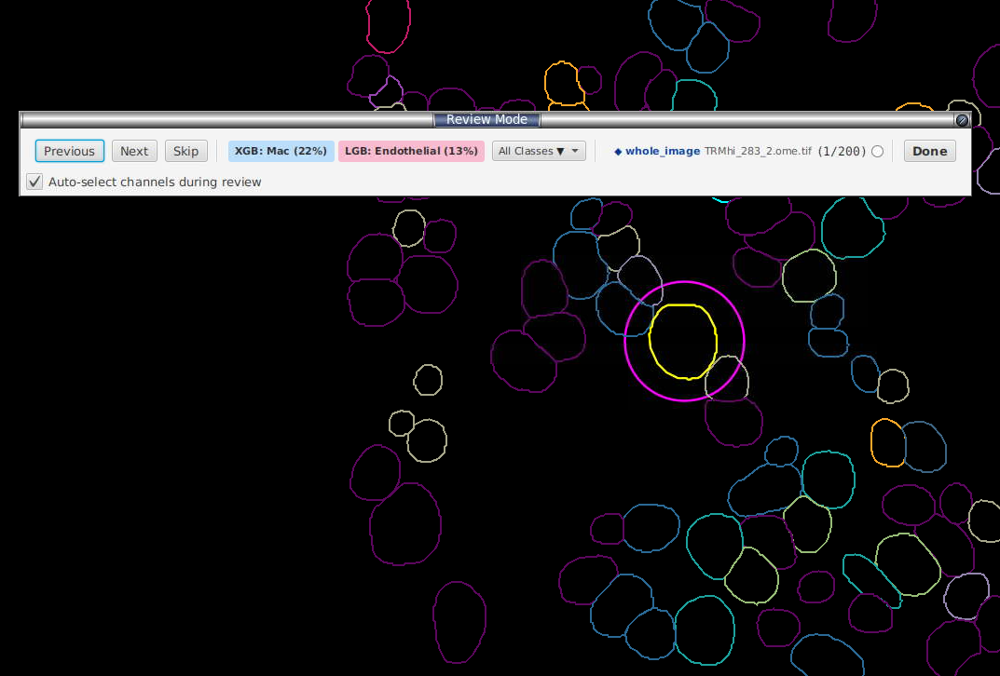

You can Ctrl/Cmd-click several cells at once to label a group together; the toolbar header shows `→ clicked cell` for the active selection:

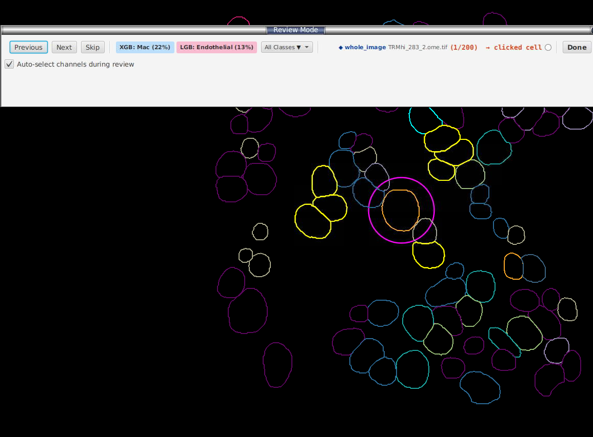

**Toolbar buttons during review:**
- **Previous / Next / Skip** — navigate the queue.
- **XGB: ClassName (89%)** — accept Model 1's top prediction; blue background.
- **LGB: ClassName (76%)** — accept Model 2's top prediction; pink background.
- **Both: ClassName (XX%)** — single combined button if M1 and M2 agree.
- **Avg: ClassName (XX%)** — appears only when the two models' **averaged** probability points to a class that is neither model's own top pick; accepts that averaged prediction.
- **All Classes ▼** — pick a different class if both models are wrong.
- **Done** — exit; labels are merged back into the label store and saved per-image to `<project>/celltune/image-labels/`.

The toolbar header also shows the **name(s) of the annotation region(s)** the current cell falls inside, in bold dark blue (e.g. `◆ Tumour, Stroma`), so you keep the spatial context without leaving review.

Switching to a **different image** while a classifier is trained **auto-applies** its predictions to that image first, so you can review it immediately without a separate predict step.

If you imported a marker table (§4.4), tick **Auto-select channels during review** and the viewer will display only the markers relevant to whatever class the current cell was predicted as. The separate **Auto-adjust brightness/contrast of shown channels** box (off by default) additionally auto-sets each shown channel's display range per cell; leave it unticked to keep your own brightness/contrast.

After review, click **Train** again — the new labels feed into the next cycle.

---

## 8. Project Prediction Summary - Experimental

**Menu:** *Extensions → CellTune Classifier → Project Prediction Summary...*

Cohort-level QC across every image in your project. Loads the saved `Pred_ALL` results from `<project>/celltune/image-predictions/` and runs an anomaly analysis. See [HOW_IT_WORKS_PREDICTION_SUMMARY](#anatomy-of-the-anomaly-score) below for the maths.

> For a **cells-free** prescreen that works straight off the pixels — before any segmentation exists — see §[17 Image pixel prescreen](#17-image-pixel-prescreen-whole-image-qc-no-cells-needed).

**Table columns:** Image, Predicted, Agreements, Disagreements, Agreement %, Anomaly, Flagged.

**Filters:**
- **Flagged only** — hide rows with no flag.
- **Target class** — restrict to images where a specific rare class is enriched.
- **Threshold preset** — *strict* (anomaly ≥ 1.5), *balanced* (≥ 0.5), *sensitive* (≥ 0.0, default — shows everything). This is a **display** filter; the analysis is not re-run.

**Buttons:**
- **Open Selected Image** — jumps QuPath to that image without saving the current one (deliberately fast for navigation).
- **Export CSV** — flattened table of currently-visible rows.

**Details pane** (below the table) for the selected row: anomaly score, flag reasons, rare-enrichment summary, per-class counts.

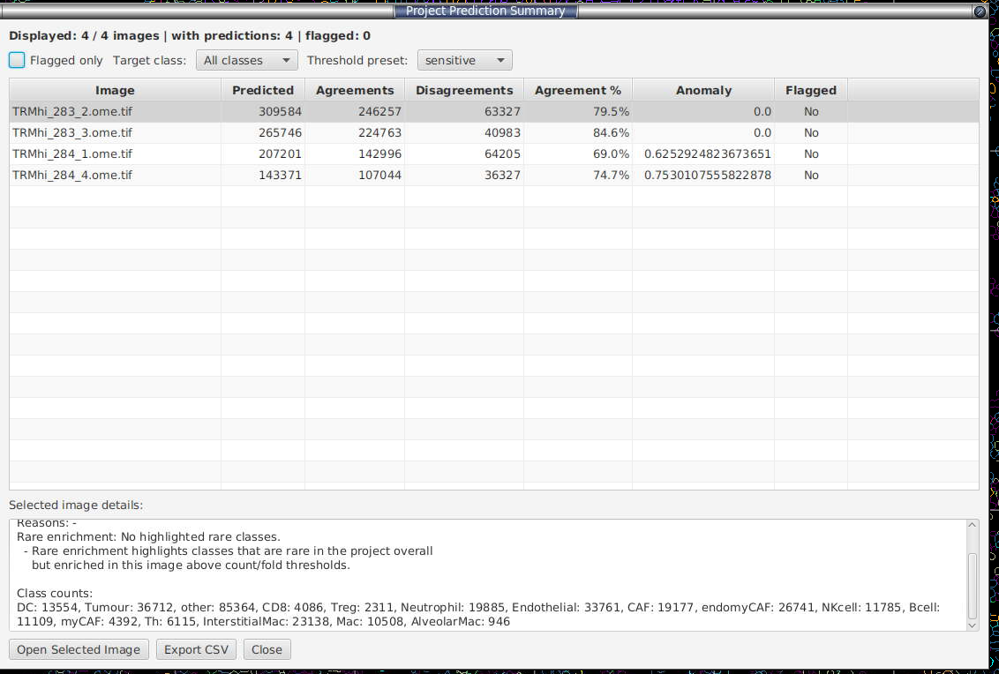

### Anatomy of the anomaly score

For each image:

1. **Composition distance** — Jensen-Shannon distance between this image's class-fraction distribution and the project-wide baseline (with Laplace smoothing).
2. **Disagreement rate** — `disagreements / predicted`.
3. Both signals are converted to **robust z-scores** (median + MAD, so one extreme image can't suppress the scale) across the cohort.
4. `Anomaly score = 0.65 × max(0, z_composition) + 0.35 × max(0, z_disagreement)`.

**Flag reasons:**
- `RARE_ENRICHMENT` — a class that is <1% of the cohort, has ≥20 cells in this image, and is ≥3× enriched vs the baseline.
- `COMPOSITION_OUTLIER` — composition robust z ≥ 3.
- `HIGH_DISAGREEMENT` — disagreement robust z ≥ 3.

**Why these numbers?** Most are standard statistical conventions, not arbitrary:
- **Robust z ≥ 3** is the classic *3-sigma* outlier rule. The robust z uses `0.6745 × (value − median) / MAD`, where `0.6745` is the constant that makes MAD a consistent estimator of the standard deviation for normal data — so the score sits on the same scale as an ordinary z-score and "≥ 3" means the same thing it always does (~0.1% one-tailed under normality).
- **Rare enrichment (<1%, ≥20 cells, ≥3×)** is an **AND gate**: a class must be rare cohort-wide *and* have enough cells to not be noise *and* be meaningfully concentrated here. The ≥20-cell floor stops a handful of misclassifications from faking a "3× enrichment"; <1% and 3× are round "rare" / "real, not jitter" conventions.
- **Laplace smoothing** (add-one) keeps a class with zero cells in one image from blowing up the composition distance.
- **0.65 / 0.35 weighting** is the one judgement call. Composition drift (a slide whose whole class makeup differs) is a more trustworthy "this slide is different" signal than raw disagreement rate, which is noisier and partly an artefact of *which two model types* you picked — so composition gets the heavier weight. The two weights are forced to sum to 1, so the score is a convex blend, not two independent dials. Treat the score as a **ranking aid**, not a calibrated probability.

**How to use it:**
- Sort by Anomaly (default). Top rows = look at these first.
- Flagged + high disagreement → the classifier doesn't understand this slide. **Open it, label 10–20 cells, re-train.**
- Flagged + composition outlier but low disagreement → real biology that's atypical for the cohort, or staining drift / segmentation artefact. Visual check.
- Rare enrichment → check whether the rare class is real (good, you've found something) or a per-slide artefact masquerading as it.

> Robust z is noisy on tiny projects (< ~5 images). Don't overinterpret on small cohorts.

---

## 9. Intensity heatmaps

**Menu:** *Extensions → CellTune Classifier → Intensity Heatmaps...*

A phenotype × marker heatmap of **mean whole-cell intensity per predicted cell class** — the standard "mean marker expression per phenotype" view used to sanity-check that each class actually expresses the markers it should (e.g. CD8⁺ T-cells are high for CD8, Tregs high for FOXP3).

Rows are cell classes (the `PathClass` assigned to each detection), columns are markers (every `"<marker>: Cell: Mean"` whole-cell measurement), and each cell is the mean intensity of that marker across all cells of that class.

When you open the heatmap you first pick which whole-cell mean measurements to include:

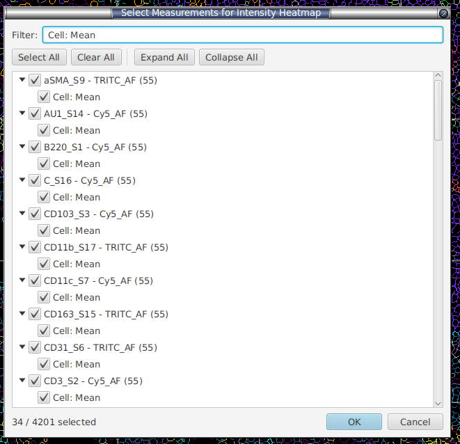

**Colour = z-score across phenotypes.** Each marker column is standardised across the class rows, so the colour highlights *which phenotype is relatively high (red) or low (blue)* for that marker, independent of the marker's absolute brightness. A diverging blue↔white↔red scale is used with a colorbar legend; grey means "no cells of that class had a valid value for that marker". The numeric mean can be overlaid in each cell via **Show mean values**.

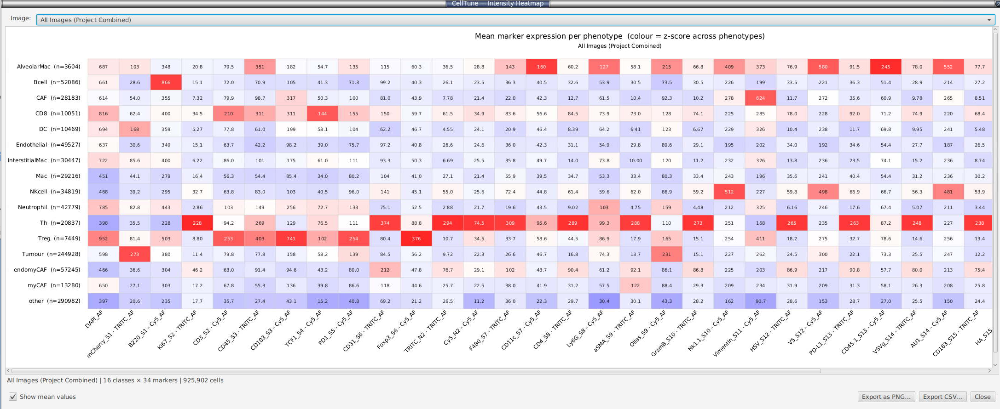

**Image selector** (top of the window):
- **The current image** (selected by default).
- **Any other project image** — loads that image's saved data in the background and computes its heatmap on demand (results are cached after the first load).
- **All Images (Project Combined)** — a project-wide heatmap computed from **true pooled means** (every cell across every image contributes equally), not an average of per-image averages.

**Buttons:**
- **Export PNG** — saves the heatmap exactly as drawn (white background).
- **Export CSV** — a `Class, CellCount, <marker>…` table of the underlying mean intensities (`NA` where a class had no valid value).

> The heatmap needs whole-cell mean intensity measurements (`"<marker>: Cell: Mean"`). If your detections don't have them, run QuPath cell detection / intensity measurement first. Classes come straight from the predictions in the viewer, so run a classifier (or apply gating) before opening the heatmap.

---

## 10. Distance measurements (spatial analysis)

**Menu:** *Extensions → CellTune Classifier → Generate Distance Measurements...*

A project-wide batch tool that adds spatial distance columns to your cell measurements — useful for downstream neighbourhood / spatial-statistics analysis. It runs across as many project images as you select, loading and saving each one for you.

It can generate three independent measurement families (tick any combination):

| Computation | What it writes per cell | Backed by |
|---|---|---|
| **Detection-to-annotation signed distances** | `Signed distance to annotation <class> <unit>` — negative inside the annotation, positive outside. | QuPath `DistanceTools.detectionToAnnotationDistancesSigned` |
| **Cross-class centroid distances** | `Distance to detection <class> <unit>` — nearest centroid-to-centroid distance to a cell of every *other* class. | QuPath `DistanceTools.detectionCentroidDistances` |
| **Same-class nearest-neighbour distances (excludes self)** | `Distance to other <class> <unit>` — distance to the nearest *other* cell of the **same** class. | The extension (spatially indexed; see below) |

`<unit>` is `µm` when a pixel size is available (from calibration or the override below), otherwise `px`.

### Dialog options

- **Images** — checklist of every project image, with **All** / **None** / **Current only** buttons. All are ticked by default.
- **Pixel size (µm/pixel)** — optional. Pre-filled from the current image's calibration when available.
  - Leave **blank** to use each image's own existing calibration.
  - Enter a value to override calibration for *every* selected image so results come out in microns.
  - **Persist this pixel size to each image's calibration on save** — when ticked, the override is written into each image's calibration metadata (so future measurements also use this scale). When unticked, the override is reverted after the run.
- **Skip images where all selected measurements already exist** (default on) — before computing, the extension scans every cell. If all cells already carry every measurement the selected computations would produce, the image is skipped entirely (no recompute, no re-save). This makes interrupted runs cheap to resume. It is **all-or-nothing per image**: if even one selected measurement is missing, the whole image is recomputed, guaranteeing internally consistent results. Untick to force recomputation (e.g. after changing classes).
- **Parallel image workers** (1–N cores) — how many images are processed at the same time.
  - The heavy distance maths for a *single* image already spreads across all CPU cores, so raising this mostly overlaps disk load/save (I/O) with compute.
  - **Many small images:** higher worker counts can speed up the batch.
  - **A few very large images (hundreds of thousands of cells):** 1–2 workers is often fastest — each image then gets the full CPU and uses less memory.

### Running it

Click **Apply**. The log area streams per-image progress, e.g.:

```
Starting on 41 image(s)…
Using 1 parallel image worker(s) (cores=14).
[slide1.ome.tif] Loading…
[slide1.ome.tif] Skipped — all selected measurements already present.
[slide2.ome.tif] Same-class nearest-neighbour distances…
[slide2.ome.tif]   Tumour: 82770 cells in 18830 ms → Distance to other Tumour µm
[slide2.ome.tif] Saved.
```

Classes with only a single cell are reported as `Skipping '<class>' (n=1)` for the same-class computation (a lone cell has no same-class neighbour). Each processed image is saved back to the project automatically. **Close** dismisses the dialog.

> **Performance note.** For large numbers of small images (10-20K cells) use a higher number of workers, for large images (500k+ cells) use one or 2 workers.

---

## 11. Cell scatter plot — clustering & gating

**Extensions → CellTune Classifier → Scatter Plots and Clustering...** opens an interactive
2D scatter plot for **unsupervised exploration**: cells are clustered — by
k-means or, optionally, graph-based Leiden clustering (§[11.6](#116-clustering-method-k-means-vs-leiden))
— on their marker measurements and projected into a 2D embedding so you can see,
label, and sub-cluster populations. This is independent of the trained
classifier — it writes to QuPath classifications, not the extension's training labels.

When you open it you first pick which measurements to embed (a *Select
Measurements for Scatter Plot* dialog). The window then computes an initial
embedding on a background thread.

> Clustering applies any **feature normalisation** you've configured
> (§[4.2](#42-clustering-normalisation)) — this is clustering-only (the classifier uses raw
> values) — then z-scores each marker over the active cells. The normalizer is captured
> when the window opens; reopen the plot after changing it.

### 11.1 Controls

**Top row**
- **Embedding** — `PCA` (fast, linear) or `UMAP` (slower, non-linear, separates
  overlapping populations better). The embedding is **for visualisation only**;
  k-means always clusters in the original marker space, not on the 2D coords.
- **Full UMAP** (checkbox, UMAP only) — by default UMAP *plots* a 20,000-cell
  sample for responsiveness (k-means still clusters **all** cells; the status bar
  shows e.g. *"309,584 clustered · 19,432 plotted"*). Tick **Full UMAP** to embed
  every cell instead — much slower and more memory-hungry on large images, but
  nothing is left out of the plot. PCA always plots all cells.
- **Method** — `k-means` (default) or `Leiden`. Choosing Leiden replaces
  **Clusters (k)** with a **Resolution** control and a reproducibility toggle —
  see §[11.6](#116-clustering-method-k-means-vs-leiden).
- **Clusters (k)** — number of k-means clusters (2–50). The legend shrinks to
  keep all clusters visible and clickable. *k-means only* — Leiden decides its
  own cluster count from the resolution instead (§11.6).
- **Recompute** — re-fit the selected clustering method + the embedding on the
  current rows (the open image, or the project sample). It does **not**
  re-sample — use **Images…** in project scope for that.
- **Scope: Current image / Project** — a toggle. *Current image* (default)
  clusters every cell of the open image with full viewer interaction. *Project*
  fits **one** k-means on a sample pooled across images you choose and drives the
  same interactive plot, so you can name and assign clusters across the whole
  cohort — see §[11.5](#115-project-wide-clustering-across-images). Switching to
  *Project* reveals an **Images…** button and a **Sample:** spinner.

**Filter row (this is the gating row)**
- **Annotation** — type a keyword to cluster only cells whose centroid falls
  inside an annotation whose name (or classification) contains that text. Blank =
  all cells. Same membership test as Review mode. *Current-image scope only* — it
  is disabled in project scope, since annotations belong to one image's hierarchy.
- **Within class** — restrict clustering to cells whose current QuPath
  classification contains this text (pick from the dropdown or type). Works in
  **both** scopes: in current-image scope it combines with the annotation filter;
  in project scope it filters the pooled sample by each cell's carried class, and
  the cohort **Assign** is then restricted to that class too (so a sub-clustering
  only rewrites cells of that class).
- **Cluster markers** — a checklist of the embedded markers, all ticked by
  default. Untick markers to cluster on a focused panel (e.g. immune markers
  only). Values are **re-standardised over the active subset** each run, so
  sub-clustering scales to the subpopulation rather than the whole image. At
  least 2 markers must be ticked.

**Bottom row**
- **Colour by** — `CLUSTER` (k-means or Leiden cluster id), `CLASS`
  (current/predicted class), or `MARKER` (single-marker intensity gradient; pick
  the marker alongside).
- **Select: Box / Lasso** — drag on the plot to select those cells (in the viewer
  in current-image scope; a plot-only highlight in project scope — see §11.2).
- **Apply Clusters… / Assign Clusters…** — see §11.3. The button's label follows
  the scope.
- **Export PNG…** — save the current plot.

### 11.2 Selecting cells

- **Box / Lasso** drag selects the enclosed points.
- **Click a cluster in the legend** (CLUSTER colour mode) selects **all** that
  cluster's cells — the cursor turns to a hand over clickable legend rows.

In **current-image scope** selection is two-way: drag/click selects the cells in
the QuPath viewer, and selecting cells in the viewer outlines them on the plot.

In **project scope** the rows are pooled from images that aren't all open, so
there is no live cell to select — drag/click instead **highlights** the points on
the plot (handy to read a region's class or marker intensity). It does not change
the viewer selection.

### 11.3 Apply Clusters / Assign Clusters — assign classes to clusters

The same dialog serves both scopes. It shows one row per non-empty cluster —
colour swatch, cell count, a **per-cluster marker heatmap** (mean z-scored
intensity: **red = high, blue = low** — the cluster's phenotype fingerprint, so
you can name it from its high markers), and a dropdown to map the cluster to an
existing class, a newly typed class, or **— skip —**.

You can manage classes without leaving the dialog: **Manage Classes…** opens
[Class Control](#43-create-classes--class-control) (add / delete / merge) and **Refresh classes**
re-reads the updated class list into every dropdown. (The dropdowns are also
editable — typing a new name creates that class on assign.)

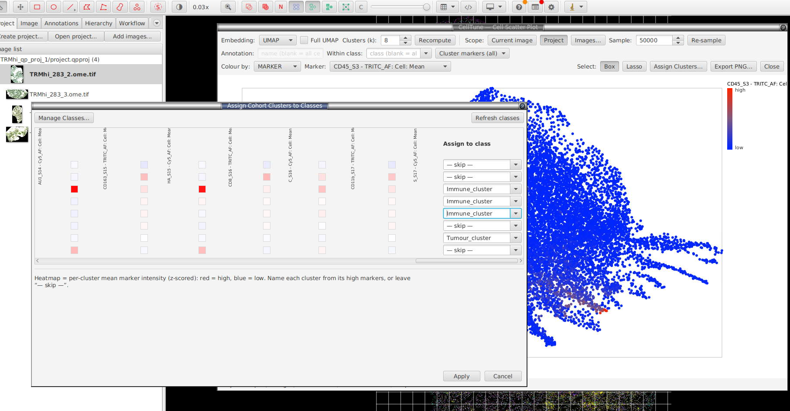

- **Current-image scope (Apply Clusters…)** — after you confirm (a second dialog
  shows the exact cell count), the chosen classes are written to those cells'
  **classification** on a background thread. Skipped/unmapped cells are untouched.
- **Project scope (Assign Clusters…)** — see §[11.5](#115-project-wide-clustering-across-images);
  the mapping is streamed and saved across every selected image.

Either way this replaces any existing class on the mapped cells; it does **not**
touch the extension's ground-truth training labels.

### 11.4 Cluster-within-clusters (hierarchical gating)

The filter row lets you gate, then re-cluster inside a gate — the standard
two-level phenotyping workflow:

1. Cluster all cells on all markers → **Apply Clusters** → assign the cardinal
   classes (e.g. **Tumour / Immune / Other**).
2. Set **Within class: Immune**, open **Cluster markers** and tick only the
   immune markers (CD45, CD3d, CD8A, CD4, CD20, PD1, FOXP3) → **Recompute**.
   Only immune cells re-cluster, on immune markers, re-standardised within the
   immune subset.
3. **Apply Clusters** again to name the sub-populations — type derived names like
   `Immune: CD8 T` (QuPath treats `Parent: Child` as a derived class).

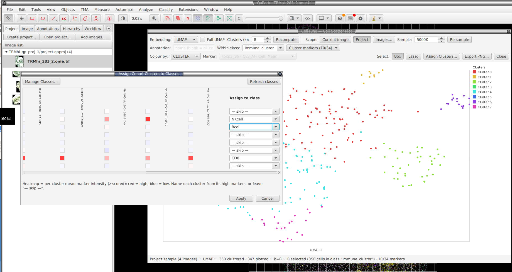

Repeat to go deeper. The status bar reports the active scope and marker count,
e.g. *"…12,840 cells in class "Immune" · 7/24 markers"*.

> **Native libraries / `--add-opens`.** PCA and UMAP use native math libraries
> (OpenBLAS / ARPACK via JavaCPP). The extension opens the required JVM module access
> automatically at startup, so no launch flags are normally needed. If that ever
> fails on a locked-down JVM, the plot falls back to PCA and the status bar
> suggests launching QuPath with
> `--add-opens=java.base/java.lang=ALL-UNNAMED`.

### 11.5 Project-wide clustering across images

To cluster a **whole cohort consistently**, flip the **Scope** toggle to
**Project**. The extension fits **one** model on a sample pooled across the
images you choose, then (when you assign) maps *every* cell in *every* selected
image to that same cohort clustering — so cluster 3 means the same phenotype in
every image (unlike clustering each image separately, which gives non-comparable
cluster ids). It all happens in the same window, so every tool — colour-by-marker,
within-class gating, the cluster-marker subset, the centroid heatmap — is
available for naming the cohort's clusters.
**k-means** assigns by nearest cohort centroid; **Leiden** assigns by kNN label
transfer against the labelled fitted sample — see §[11.6](#116-clustering-method-k-means-vs-leiden).

**Entering project scope**

1. Click **Project**. An image picker opens — choose which project images to
   sample (defaults to all). Cancel to stay on the current image.
2. The extension streams each image and pools a bounded random sample (the **Sample:**
   spinner, default 50,000, drawn evenly per image), then fits k-means and draws
   the plot. The status bar reads e.g. *"Project sample (8 images)"*.

The sample only bounds the **fit** — 50,000 cells is statistically ample to place
stable centroids (more barely move them but cost time). **Every** cell is still
classified later in the assignment pass, so memory stays flat regardless of
project size.

**Working with the cohort sample**

The plot behaves like the single-image one, with the project caveats already
noted: the Annotation filter is disabled (§11.1), and box/lasso/legend selection
highlights on the plot only (§11.2). Everything else applies:

- **Colour by → MARKER** to read which clusters are high in which marker.
- **Within class** to sub-cluster one population across the cohort (the assign is
  then restricted to that class — §11.1).
- **Cluster markers** to fit on a focused panel.
- **Recompute** re-fits on the existing sample (fast). To draw a fresh sample —
  different images, or a new **Sample:** size — click **Images…**.

**Assigning across the cohort**

Click **Assign Clusters…**. The shared assignment dialog (§11.3) shows the
per-cluster mean marker heatmap and a class dropdown per cluster. On confirm,
The extension streams each selected image, assigns all matching cells to their cluster
(nearest centroid for k-means; kNN label transfer against the fitted sample for
Leiden — §[11.6](#116-clustering-method-k-means-vs-leiden)), writes the mapped
classes, and **saves each image**, with progress in the status bar.

> **Measurement scaling & batch effects.** Clustering applies the extension's feature
> normalisation (§[4.2](#42-clustering-normalisation)) — arcsinh / sqrt, a **clustering-only**
> step (the classifier uses raw values) — then z-scores each marker over the active cells
> at fit time. So if you've configured normalisation, it shapes the clusters and
> the colour-by-marker view too. (The normalizer is captured when the window
> opens; change it via *Clustering Normalisation* and reopen the plot to pick it up.)

**Leiden cohort modes: "Cluster all cells" vs "Transfer from sample"**

When **Method = Leiden** and **Scope = Project**, a radio pair appears next to the
Method selector (hidden for k-means, and hidden in current-image scope):

- **Cluster all cells** (default) — the exact, true-scanpy `sc.tl.leiden`-style
  mode: **every** cell across every selected image is pooled into one feature
  matrix, one approximate-NN (HNSW) kNN graph is built over the whole cohort, a
  **single** CWTS Leiden partition runs over that entire graph, and each cell's
  community label is written back to its source image by its stable cell UUID
  (not by iteration order — safe even if a second read of an image returns cells
  in a different order). This genuinely clusters every cell, rather than
  approximating the rest of the cohort from a sample.
- **Transfer from sample** — the fast/approximate mode retained from the previous
  release: Leiden fits once on the pooled sample, then every other cell is
  assigned by kNN label transfer against that labelled sample (`sc.tl.ingest`-style
  — see §[11.6](#116-clustering-method-k-means-vs-leiden)).

Clicking **Assign Clusters…** / **By cluster (all images)** with **Cluster all
cells** selected runs the two-pass all-cells driver instead of the transfer path:

- **Soft cell-count ceiling.** Before pooling starts, the extension does a quick
  count-only pass over the selected images to estimate the total pooled cell
  count. If that estimate is above a configurable ceiling (50,000,000 cells by
  default), an extra confirm dialog warns you before the run begins — it warns,
  it does not hard-block.
- **Per-phase progress.** The status bar reports each phase as it happens —
  *"Pooling 12/40 images"* → *"Building kNN graph…"* → *"Running Leiden…"* →
  *"Writing 12/40 images"* — followed by the run's outcome.
- **ANN recall gate.** The HNSW graph build is checked at runtime against an
  exact nearest-neighbour reference on a small sample; the status line reports
  the measured recall (e.g. *"ANN recall 0.982 — passed"*) when the driver
  exposes it. If recall cannot reach the required 95% after auto-tuning, the run
  **aborts with no `Cluster` labels written at all** — an actionable error
  explains why; existing `Cluster` measurements from a previous successful run
  are left untouched.
- **Cancel.** A **Cancel** button appears only during an all-cells run. Cancelling
  stops the write pass before its next image — images already written keep their
  `Cluster` measurement (no rollback); the final status line reports how many
  images were, and were not, written.
- **Legend re-sync.** After a successful (non-cancelled, non-aborted) all-cells
  write, the scatter legend and the open image's overlay re-sync to the **final
  all-cells cluster count** — the number Leiden actually found across the whole
  cohort — not the interactive preview's (subsample-based) cluster count. The
  interactive plot itself always stays subsample-based for responsiveness; only
  the persisted `Cluster` measurement (and, after the write, the legend/overlay)
  reflects the full all-cells run.

Single-image Leiden (current-image scope, and the interactive project-scope
preview fit) also builds its kNN graph through the same HNSW approximate-NN index
now, rather than a brute-force scan — this is transparent (no extra control) and
only matters if you happen to hit the same recall gate on a single image, in
which case the status bar reports it and asks you to try more cells or different
markers.

> **Fidelity vs stock scanpy.** The extension's Leiden clustering (both cohort modes
> and the single-image path) is a close, but not bit-identical, match to running
> `sc.tl.leiden` in Python. Two remaining documented gaps (a third — PCA — is now
> implemented, see below):
>
> 1. **Quality function** — the bundled CWTS Leiden library optimises the
>    **Constant Potts Model (CPM)**, not scanpy's default **modularity**
>    (RBConfiguration). The `Resolution` control behaves like the familiar
>    scanpy/leidenalg knob (association-strength normalisation keeps it on the
>    same rough scale), but is not numerically identical to a modularity run.
> 2. **Edge weighting** — the extension weights the kNN graph by **Jaccard
>    similarity of shared nearest neighbours (SNN)**, not scanpy's **UMAP
>    fuzzy-simplicial-set connectivities**.
>
> Neither is expected to change population-level conclusions for multiplex-
> imaging marker panels, but an external `sc.tl.leiden` run on the same data is
> not guaranteed to reproduce identical cluster boundaries.

> **PCA dimensionality reduction (scanpy `scale → PCA → neighbors` recipe).**
> Both cohort modes and the single-image path apply a conditional PCA reduction
> to the z-scored marker matrix *before* building the clustering kNN graph (both
> k-means and Leiden) — a **"Reduce dims (PCA)"** checkbox (on by default) and a
> components spinner (default 50) sit next to the Resolution/k controls. Below
> ~50 active marker columns this is a no-op (a small, curated panel is already
> low-dimensional — projecting onto ≥ p components is just a lossless rotation),
> preserving the exact prior small-panel behaviour. Above that threshold — real
> projects can carry hundreds to 1000+ per-cell measurements (each marker × mean/
> median/percentile × nucleus/cytoplasm/membrane) — unreduced Euclidean kNN both
> lets whichever marker happens to have the most measurement columns dominate
> the distance, and suffers high-dimensional distance concentration; PCA fixes
> both. The reduction uses the same exact (deterministic, non-randomized) Smile
> `PCA` eigendecomposition already used for the 2D display embedding, so the
> reproducible-seed clustering path stays bit-stable. Per-cluster centroids (the
> Assign-dialog heatmap) and the interpretive marker view are always computed in
> the **original marker space**, never the PCA space — only the neighbour graph
> itself is built on the reduced matrix. On the all-cells cohort path, the PCA
> projection is **fit on a bounded seeded subsample** (like the ANN recall gate's
> sampling) when the pooled cohort is very large, then applied to every pooled
> cell — bounding fit cost/memory independent of total cell count. When applied,
> the status bar/log reports `PCA: {p} → {nComp} comps, {variance}% variance`.

> **Citing.** Graph-based clustering here uses the **Leiden algorithm** (Traag,
> Waltman & van Eck, *Sci. Rep.* 2019) and mirrors the **scanpy** scale → PCA →
> neighbours → Leiden recipe (Wolf, Angerer & Theis, *Genome Biol.* 2018); the
> scalable kNN graph uses **HNSW** (Malkov & Yashunin, *IEEE TPAMI* 2020). If
> graph-based clustering is central to your analysis, please cite these — full
> citations and the bundled-library licenses (CWTS `networkanalysis`, jelmerk
> `hnswlib-core`) are in the [README acknowledgements](README.md#acknowledgements).

### 11.6 Clustering method: k-means vs Leiden

The **Method** selector (§11.1) switches the clustering algorithm; everything
else in this section — the embedding, colouring, selection, within-class gating,
cluster-marker subsetting, and cluster→class assignment — works identically for
both, because both ultimately produce the same per-cell cluster label array.

- **k-means** (default) partitions cells into a **fixed** number of clusters (the
  **Clusters (k)** spinner, 2–50). It assumes clusters are roughly spherical and
  similarly sized, and you must pick `k` up front.
- **Leiden** is graph-based community detection — the same family of algorithm
  used by scanpy, scimap, and SPACEc for single-cell / multiplex-imaging
  phenotyping (it traces back to PhenoGraph). Instead of a fixed `k`, the extension
  builds a nearest-neighbour graph over the z-scored marker matrix, weights edges
  by neighbourhood similarity (Jaccard), and runs the Leiden algorithm — the
  **number of clusters is decided by the data**, not chosen in advance. This finds
  non-spherical and unequal-size populations — including rare cell types — that
  k-means tends to under-resolve or merge into a larger neighbour.

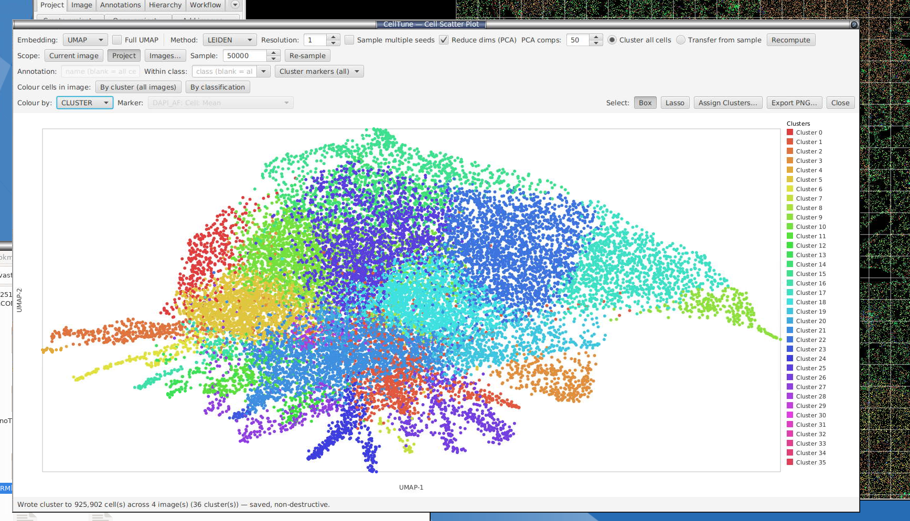

**Controls when Method = Leiden**

- **Resolution** (0.1–3.0, default 1.0) — replaces **Clusters (k)**. Higher
  resolution finds **more, smaller** communities; lower resolution finds **fewer,
  larger** ones. There is no fixed cluster count to set — after **Recompute** the
  status bar reports how many clusters Leiden found, e.g.
  *"…· Leiden found 7 cluster(s)"*. If you want more (or fewer) populations,
  raise (or lower) the resolution and **Recompute** again.
- **Sample multiple seeds** (checkbox) — mirrors k-means' multi-restart
  reproducibility: when ticked, Leiden runs several random-seeded passes and keeps
  the best-quality partition, so repeated runs with the same settings return
  identical clusters. Left unticked, Leiden runs a single faster pass whose exact
  result may vary run to run (the same *populations* are still found — only which
  integer id each gets can shift).

The kNN graph-neighbour count and edge-weighting scheme are fixed, sensible
defaults (not exposed as controls in this release) — see the design note in the
repository for the full recipe and rationale.

**Cohort (project scope) assignment differs by method**

Leiden has no centroids to assign new cells to — averaging a non-spherical
community into one point would defeat the method. So in **Project** scope
(§11.5), Leiden fits once on the pooled sample exactly like k-means does, but the
**assignment** pass differs:

- **k-means** assigns each cell to its **nearest cohort centroid** (Euclidean, in
  z-scored marker space).
- **Leiden**, with **Transfer from sample** selected (§11.5), assigns each cell by
  **kNN label transfer**: it finds that cell's nearest neighbours *within the
  labelled fitted sample* and takes a majority vote of their Leiden labels — the
  same approach scanpy uses (`sc.tl.ingest`) to map new cells onto an existing
  clustering. Per-cluster mean marker profiles are still computed for the
  assignment-pane heatmap either way — only the per-cell assignment mechanism
  differs. With **Cluster all cells** selected instead, there is no separate
  "assign" step at all — every cell is a first-class member of the single
  cohort-wide Leiden partition (§11.5).

Both methods otherwise share the exact same pipeline: the same z-scored active
marker matrix, the same `cluster[]` label array driving plot colour/legend/box
selection, and the same **Apply Clusters… / Assign Clusters…** dialog for naming
populations.
> Even so, per-marker normalisation does not fully correct **per-image** staining
> differences, so when cells are pooled across a cohort, comparable staining still
> matters: globally brighter slides can shift the pooled clusters. Normalise
> upstream if intensity scales differ a lot, or interpret with that in mind.

> **This writes classifications and saves every selected image.** It replaces the
> existing class on assigned cells (the extension's training labels are untouched). The
> currently-open image updates live; others are saved to disk.

---

## 12. Exporting results

### 12.1 Cell table export

**Menu:** *Extensions → CellTune Classifier → Export ▸ Cell Table...*

For each selected image, writes `<ImageName>.csv` to your chosen folder with one row per detection:

| Column | Notes |
|---|---|
| `Image` | Source image name |
| `CellID` | QuPath cell UUID |
| `CentroidX_um` / `CentroidY_um` | Centroid in microns, 2 decimals (falls back to pixel × calibration) |
| `Area_um2` | Cell area in microns², 2 decimals |
| `Classification` | Current `PathClass` (empty if unclassified) |
| `ParentAnnotations` | All ancestor annotations, joined with `; ` |
| `ContainingAnnotations` | Every annotation whose ROI geometrically contains the cell centroid (captures overlapping regions the hierarchy discards), joined with `; ` |
| `Geometry_um` / `Geometry_px` | *(optional)* WKT `POLYGON` of the ROI outline, in microns or pixels — only written when polygon export is enabled |
| feature columns | One column per measurement **or metadata field** you tick in the export dialog |

Before exporting, a **Select Columns for Cell Table Export** dialog opens. It mirrors the *Select Features* dialog — search box, prefix dropdown, **Select Prefix** / **Clear Prefix**, **Select All** / **Clear All**, and a per-row checkbox — so you can pick exactly which columns land in the CSV. It pre-selects the curated subset (whole-cell means + any distance measurements). The chooser lists the **numeric measurements first, then the string metadata fields** (e.g. `CN Class`, `… original class`) — so text labels that aren't numeric measurements can now be exported too; filter for them by name if the list is long. Below the list, tick **Export cell polygons (geometry)** to include the ROI outline, and use the **Units** dropdown to choose **Microns (µm)** (`Geometry_um`) or **Pixels** (`Geometry_px`). Numeric measurements resolve to their value, metadata columns to their text value, and anything a cell doesn't have is written as `NA`.

### 12.2 Ground truth export & import

The extension's ground-truth files are a portable representation of your labelled cells **and** their feature vectors — they let you reuse labels across projects/workstations.

#### Export

**Menu:** *Extensions → CellTune Classifier → Export ▸ Ground Truth...*

Header (commented):
```
# CellTune Ground Truth Export
# Image: my_image.ome.tiff
# Exported: 2026-06-02T14:30:45
Image,Label,CentroidX,CentroidY,Feature1,Feature2,...
```

Exports **raw** feature values only — the values the classifier trains/predicts on. (Earlier versions offered a normalised `__norm` column set; that was removed when normalisation became clustering-only.) Only labelled cells are exported.

In multi-class mode the export pools labels from the current image plus all other project images. In **binary mode** use the dedicated menu item **Export ▸ Active Binary Ground Truth...** — it scopes to the active marker and includes previously-imported training rows from prior projects (so you can losslessly round-trip between projects).

#### Import

**Menu:** *Extensions → CellTune Classifier → Import ▸ Ground Truth...*

After picking the CSV you choose one of two modes:

1. **Spatial Match** (per-image) — each imported row is matched to the nearest detection by centroid distance (you set the max threshold, default 20 px). Rows outside the threshold are skipped. Use this when you're re-importing labels onto the **same** image they were exported from.
2. **Training Data Only** (cross-project) — imports the feature vectors + labels without mapping back to cells. Use this when the source image isn't open in the current project; the rows feed straight into the next training run as if they were locally-labelled cells. The sidebar shows the count as `Imported rows: N`.

The binary equivalents are **Import ▸ Active Binary Ground Truth...** — same modes, but scoped to the active marker.

> **There is no "ground truth bundle" (ZIP)** currently — only the per-CSV import/export described here. The `.planning/phases/12` document scopes a bundle format as a future feature.

---

## 13. Utility scripts

*Extensions → CellTune Classifier → **Utility Scripts***

A grab-bag of common housekeeping operations that would otherwise live in one-off Groovy scripts. Each prompts for its parameters and reports what it did.

### 13.1 Filter Cells by Size & Circularity

Removes cell detections that are likely mis-segmented or artefacts. A dialog takes an optional **Min** and **Max** for both **Cell area (µm²)** and **Circularity** — leave any field blank for no bound. A cell is removed if it violates *any* active bound (e.g. `area > 500` **or** `circularity < 0.7`). Cells missing either measurement are skipped, not removed. The number of cells to be removed is shown for confirmation first; the operation acts on the **current image** only.

### 13.2 Resolve Hierarchy

Rebuilds parent/child relationships from ROI containment — equivalent to the `resolveHierarchy()` scripting call. Choose **Current image** (resolves and refreshes immediately) or **All project images** (confirms first, then resolves and saves every entry). Project-wide work runs in the background so QuPath stays responsive; the open image updates straight away.

### 13.3 Delete Measurements by Keyword

> ⚠️ **Destructive and not undoable.** Double-check the keyword against your actual measurement names — a loose keyword can delete more columns than you intend.

Removes every detection measurement whose name contains a keyword (case-insensitive by default; tick **Case sensitive** to match exactly). Choose **Current image** or **All project images**. Before deleting, the extension previews the exact list of matching columns and asks you to confirm — if nothing matches, it aborts. Project-wide saves each entry (open image first, the rest in the background).

### 13.4 Import GeoJSON Objects

> ⚠️ **For small-to-medium GeoJSON only.** This importer loads the whole file into QuPath's memory, so very large files (hundreds of MB / millions of objects) can exhaust the heap and crash QuPath. For those, use the dedicated headless pipeline instead: [github.com/BioimageAnalysisCoreWEHI/import_large_geojson](https://github.com/BioimageAnalysisCoreWEHI/import_large_geojson).

Imports annotations and detections from a `.geojson` (or gzipped `.geojson.gz`) file into the **current image**. Pick the file, then choose whether to **clear existing objects first** and whether to **resolve the hierarchy** afterwards (off by default — it is O(n²) and slow for many objects). Parsing streams the file feature-by-feature on a background thread; objects are added annotations-first (locked), then detections, and the image data is saved automatically.

### 13.5 Export Annotation Regions

> ⚠️ **Single-image, small-to-medium exports.** Pixels are streamed tile-by-tile so memory stays bounded, but very large regions or whole-project batch exports are far faster headless on HPC. For those, use the dedicated pipeline: [github.com/BioimageAnalysisCoreWEHI/export_large_annotation_regions](https://github.com/BioimageAnalysisCoreWEHI/export_large_annotation_regions).

Exports one or more annotation ROIs from the **current image** as polygon-**masked** OME-TIFFs — pixels outside the annotation shape are zeroed, so you get the annotation region rather than its rectangular bounding box. Enter a comma-separated list of annotation names (leave blank to export **all** annotations), set the **downsample**, **tile size**, **writer threads**, **compression** (LZW by default), and whether to write **BigTIFF** and a **pyramid**, then choose an output directory. Each region is written to `<image>__<annotation>.ome.tif` on a background thread, and a notification reports how many succeeded. Requires QuPath's built-in Bio-Formats extension (loaded by default).

### 13.6 Reset CellTune Project State

> ⚠️ **Destructive.** Permanently deletes everything the extension has saved for this project. Intended for starting over — e.g. when you've **copied a project** to trial different ML options and want a clean slate, since the `celltune/` state travels with the copy.

Deletes the project's entire `celltune/` folder: all labels and per-image label files, trained classifiers (multi-class **and** binary) and predictions, feature selection, normalisation, marker table, composite rules, and sampling/review state. It also resets the running session so nothing re-saves the old state.

**Safety net:** before deleting anything, a timestamped **`celltune_backup_<timestamp>.zip`** is written to the project folder. To undo a reset, unzip it back into the project folder (recreating `celltune/`). The action is guarded by a typed **`RESET`** confirmation.

**Images and detections are kept.** The extension's ground-truth **label points** and the **cell classifications** (predictions) it paints onto cells live in each image's `.qpdata`, *not* in `celltune/`. They are left in place unless you tick **"Also clear CellTune label points and all cell classifications from every image"**, which strips classified point annotations and clears every cell's classification across **all** project images (this rewrites each image's data and runs on a background thread). Tissue/region annotations and unclassified points are never touched.

---

## 14. Reference: every setting in the sidebar

| Control | Default | What it does |
|---|---|---|
| **Rounds** | 200 | Boosting iterations (50–1000). Increase for complex data; decrease for fast trials. |
| **Max depth** | 6 | Tree depth (2–15). Higher = more complex interactions, more overfit risk. |
| **Workers** | 1 | Parallel image-prediction workers (1–8). Each loads a full slide; RAM-bound. |
| **Model 1** | XGBoost | First ensemble model. |
| **Model 2** | LightGBM | Second ensemble model. **Pick a different type** for meaningful disagreement. |
| **Pool labels from all images** | ✅ | Train on labels from every image; auto-on/locked in binary mode. |
| **Enable data balancing** | ✅ | Apply resampling. Hides the strategy dropdown when off. |
| **Strategy** | SMOTE + Tomek | Resampling algorithm — see §5.4 table. |
| **Auto-tune hyperparameters** | ❌ | TPE Bayesian search per model. Slow but explores rounds/depth/eta/subsample. |
| **Early stopping** | ✅ | Stop boosting when val loss plateaus (patience 20). |
| **Show top 10 feature importance after training** | ✅ | Auto-open SHAP plot after training. |
| **Auto-prune features** | ✅ | Drop near-constant & redundant features across the pooled, normalised training set before training; the top 5 highest-variance features per group are always kept. Non-destructive. See §[4.1](#41-select-features). |
| **Restrict to features shared with imported data** | ❌ | Case-insensitive intersection with imported ground-truth columns. |
| **Sample current image only** | ❌ | Restrict sampling/review to the open image. |
| **Filter by annotation keywords** | (blank) | Comma-separated substring filter on annotation names. |
| **Apply to which images...** | (all) | Open dual-list selector. Button label updates with count. |
| **Manual Label Mode** | — | Open floating labelling toolbar. |
| **Train** | — | Start training. Requires ≥10 labelled cells. |
| **Plot Confusion...** | (disabled) | Inter-model agreement matrix. Unlocks after training. |
| **Training Metrics** | (disabled) | Per-class precision/recall/F1 on 20% held-out split (≥20 labelled cells). |
| **Feature Importance...** | (disabled) | SHAP top-N per class. Unlocks after training. |
| **Enter Review Mode** | (disabled) | Sample disagreement cells for human review. Unlocks after predictions exist. |

---

## 15. Reference: every CellTune menu item

All under *Extensions → CellTune Classifier*.

| Item | Requires | Action |
|---|---|---|
| Binary Classifiers... | Project | Open the binary classifier manager (create/open/delete per-marker classifiers). |
| Composite Classification... | Project + ≥1 trained binary | Apply trained binary classifiers and assign composite labels. |
| Class Control... | Project | Add/Delete/Merge/Undo Merge classes. |
| Select Features... | Project | Pick which measurement columns are used for training. |
| Clustering Normalisation | Project | Per-feature arcsinh/sqrt with shared cofactor (clustering-only; classifier uses raw). |
| Project Prediction Summary... | Project | Cohort QC, anomaly scoring, per-image flags. |
| Image Pixel Prescreen... | Project | Cells-free whole-image QC: per-channel pixel statistics on a low-res pyramid level, cohort z-scores, verdicts/flags (background-heavy, saturated, weak signal, intensity outlier), CSV export. See §[17](#17-image-pixel-prescreen-whole-image-qc-no-cells-needed). |
| Intensity Heatmaps... | Open image with detections | Phenotype × marker mean-intensity heatmap (z-score coloured), per-image / project-combined, PNG/CSV export. See §[9](#9-intensity-heatmaps). |
| Generate Distance Measurements... | Project | Batch spatial distances (annotation-signed, cross-class, same-class NN) across selected images. See §[10](#10-distance-measurements-spatial-analysis). |
| Scatter Plots and Clustering... | Open image with detections | Interactive PCA/UMAP embedding + k-means clustering, annotation/class gating, cluster→class assignment, and a **Scope** toggle for cohort-wide clustering across images in the same window. See §[11](#11-cell-scatter-plot--clustering--gating). |
| Export ▸ Cell Table... | Open image with detections | One CSV per selected image. |
| Export ▸ Ground Truth... | Open image with labels (multi-class) | Portable labels + feature vectors CSV. |
| Export ▸ Active Binary Ground Truth... | Binary mode active + open image with labels | Same as above, scoped to active marker. |
| Import ▸ Marker Table... | Open image | Load cell-type → markers mapping for review channel switching. |
| Import ▸ Ground Truth... | Open image (multi-class) | Spatial-match or training-data-only mode. |
| Import ▸ Active Binary Ground Truth... | Binary mode active + open image | Same as above, scoped to active marker. |
| Utility Scripts ▸ Filter Cells by Size & Circularity... | Open image with cells | Remove cells outside optional area/circularity bounds (current image). See §[13.1](#131-filter-cells-by-size--circularity). |
| Utility Scripts ▸ Resolve Hierarchy... | Open image or project | Rebuild parent/child relationships (`resolveHierarchy()`); current image or whole project. See §[13.2](#132-resolve-hierarchy). |
| Utility Scripts ▸ Import GeoJSON Objects... | Open image | Import objects from a (gzipped) GeoJSON into the current image — **small-to-medium files only**. See §[13.4](#134-import-geojson-objects). |
| Utility Scripts ▸ Export Annotation Regions... | Open image | Export annotation ROIs from the current image as polygon-masked OME-TIFF(s) — **single-image, small-to-medium**. See §[13.5](#135-export-annotation-regions). |
| Utility Scripts ▸ Delete Measurements by Keyword... | Open image or project | **Destructive:** delete detection measurements matching a keyword, with preview/confirm. See §[13.3](#133-delete-measurements-by-keyword). |
| Utility Scripts ▸ Reset CellTune Project State... | Project | **Destructive:** wipe the project's `celltune/` state (labels, models, predictions, settings) for a clean slate; writes a backup zip first, typed-`RESET` confirm, optional per-image artifact stripping. See §[13.6](#136-reset-celltune-project-state). |

---

## 16. Project directory layout

Everything the extension writes is under `<project>/celltune/`:

```
celltune/
├── classifier-state.json         # Multi-class model (features, classes, model bytes, labels, normalisation)
├── composite-rules.json          # Saved CompositeClassificationRule objects (advanced/programmatic)
├── marker-table.json             # Imported marker table (auto channel switching) — persists across restarts
├── binary-registry.json          # markerName → state file path
├── labels_backup_YYYYMMDD_HHMMSS.json   # Auto-snapshot before each Train
│
├── image-labels/                 # Multi-class labels, one JSON per image
│   ├── slide1.json               #   { "<cellId>": "T-Cell", ... }
│   └── ...
│
├── binary-image-labels/<marker>/ # Same per-image JSON, scoped per binary marker
│   ├── CD3/slide1.json
│   └── ...
│
├── binary/                       # Binary classifier state files
│   ├── CD3.json
│   ├── CD8.json
│   └── ...
│
├── image-sampled/                # Cell IDs already sampled for review
├── image-predictions/            # Per-image Pred_ALL — consumed by Project Prediction Summary
```

JSON throughout. Model bytes are Base64-encoded inside the state files. Safe to commit `celltune/` to git if you want shared review history.

---

## 17. Image pixel prescreen (whole-image QC, no cells needed) - Experimental

**Menu:** *Extensions → CellTune Classifier → Image Pixel Prescreen...*

A **prescreen you run at the very start of a project** — before any segmentation or
classification exists. It reads a low-resolution version of every image straight
off the pyramid and summarises each one by its raw pixel intensities, then ranks
and flags images against the cohort. Use it to spot slides that are mostly
background, over-exposed, weakly stained, or otherwise unusual, so you can fix or
exclude them before investing in analysis. It is useful to identify images which will 
need additional attention and labelling during cell classification. It is the pixel-level twin of the
[Project Prediction Summary](#8-project-prediction-summary) (which needs cells);
this one needs none.

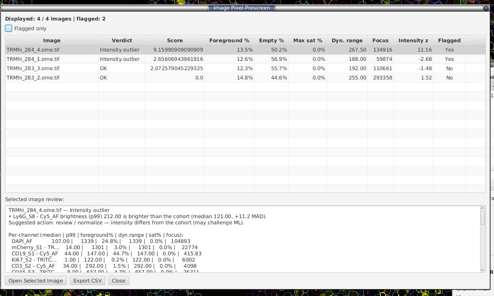

### How it works

1. For each project image, the extension reads the **nearest pyramid level whose long
   edge is ≈ 2048 px** (requested downsample = `longEdge / 2048`). Reading every
   image to the same pixel footprint keeps the cohort statistics comparable
   like-for-like, regardless of each slide's native size or pyramid structure.
   Images are **read in parallel** (a small fixed thread pool) so large projects
   scan several-fold faster.
2. Channels are **aligned across images by name**.
3. Per-channel statistics are computed (below), including a per-channel **focus**
   (Laplacian variance) sharpness proxy.
4. The image-level summaries and each **signal-bearing** channel's brightness
   (`p99`) are converted to **robust z-scores** (`0.6745 × (value − median) / MAD`)
   **across the cohort** — the same robust machinery as §8.
5. Deterministic threshold rules assign each image a **verdict**, a set of
   **flags**, and a plain-English **review**.

### What each statistic means

Per channel, over all pixels of the low-resolution image (values sorted ascending
where percentiles are involved):

| Statistic | Definition | What it tells you |
|---|---|---|
| **median** | 50th percentile | Robust brightness; the main sort/comparison value (mean's outlier-resistant cousin). |
| **mean** | `Σx / N` | Brightness including the tails; sensitive to hot pixels by design. |
| **std** | population standard deviation | Spread of intensities. |
| **min / max** | extrema | `max` is shown but **not** used for flagging — one hot pixel moves it. |
| **p1 / p99** | 1st / 99th percentiles | `p1` = noise floor, `p99` = true signal ceiling; both ignore single extreme pixels. |
| **saturation fraction** | fraction of pixels ≥ `0.999 × dtypeMax` | Clipping / over-exposure. `n/a` for floating-point images (no fixed max). Uses the **storage bit depth** (e.g. 255 for 8-bit, 65535 for 16-bit). |
| **Otsu threshold** | foreground/background split from the channel histogram | The cutoff used for the next two rows. |
| **background fraction** | fraction below the Otsu threshold | How much of the channel is background. |
| **foreground coverage** | `1 − background fraction` | How much real signal — the direct **"lots of background"** measure. |
| **dynamic range** | `p99 − p1` | Flat / weak / empty channels score near zero. |
| **Laplacian variance (focus)** | variance of the discrete Laplacian over the image | No-reference sharpness proxy (higher = sharper). Intensity-scale dependent, so best read within a cohort. |

Image-level (derived across channels):

| Statistic | Definition | What it tells you |
|---|---|---|
| **empty fraction** | fraction of pixels below the Otsu threshold in **every** channel | The single best "this slide is mostly glass/background" indicator. |
| **focus** | **max** per-channel Laplacian variance (the sharpest channel) | Sharpness proxy. **Surfaced for inspection only — never flagged**, because it tracks overall brightness as much as true focus (a dim-but-fine slide reads as low focus). The max ignores near-dead channels, which sit near zero. |
| **intensity z** | largest **signal-bearing** channel `p99` (brightness) robust-z vs the cohort | Drives the **intensity-outlier** flag — surfaces slides whose brightness profile diverges from the cohort (a likely ML challenge). Only channels with real signal contribute, so near-empty markers can't trigger it. |

### Verdicts, flags, and the score

Each image gets one **verdict** and zero or more **flags** (default thresholds, all
z-scores robust/MAD-scaled):

| Verdict / flag | Fires when |
|---|---|
| `BACKGROUND_HEAVY` | mean foreground-coverage z ≤ −2.5, **or** empty-fraction z ≥ 2.5 |
| `SATURATED` | max saturation fraction ≥ 1% **and** its z ≥ 3.0 (cohort-relative), **or** ≥ 5% in absolute terms (clipping that severe is a defect on its own) |
| `WEAK_SIGNAL` | median dynamic-range z ≤ −2.5 |
| `INTENSITY_OUTLIER` | a **signal-bearing** channel's `p99` (brightness) z magnitude ≥ 2.5 (bright **or** dim) |
| `OK` | none of the above |

> **Why signal-gated?** Intensity-outlier detection runs only on channels whose
> cohort-median foreground coverage clears a small floor (~5%). Near-dead markers
> (whose `p99` hovers at the noise floor) are excluded, so their meaningless
> relative jitter can't manufacture false "outlier" flags. **Focus is computed and
> shown but never flags** — see the image-level table above.

The **Score** is the sum of the positive deviations that drive those flags — higher
means more unusual versus the project baseline. The table is sorted by Score by
default.

**Table columns:** Image, Verdict, Score, Foreground %, Empty %, Max sat %,
Dyn. range, Focus, Intensity z, Flagged. **Filter:** *Flagged only*.

**Review pane** (below the table) for the selected image gives the plain-English
context, e.g.:

> TRMhi_284_4 — Intensity outlier
> • Ly6G_S8 - Cy5_AF brightness (p99) 1246.00 is brighter than the cohort (median 220.00, +11.2 MAD).
> Suggested action: review / normalize — intensity differs from the cohort (may challenge ML).

…followed by a per-channel breakdown (median | p99 | foreground% | dyn.range | sat% | focus).

**Buttons:** *Open Selected Image* (jumps QuPath there without saving the current
one), *Export CSV* (wide layout — image-level columns including `MaxFocus`,
`MaxFocusZ`, `MaxIntensityZ`, `MaxIntensityChannel`, plus a block of per-channel
columns — including `LaplacianVariance` — for every channel in the cohort), *Close*.

### How to read it

- **Sort by Score** (default). Look at the top rows first.
- **Background-heavy** → mostly glass/empty. Exclude, re-acquire, or crop to the tissue.
- **Saturated** → a channel is clipped. Fix exposure or drop it from intensity-based analyses.
- **Weak signal** → flat, low-contrast image. Staining or exposure problem.
- **Intensity outlier** → a signal-bearing channel is far brighter/dimmer than its peers. The review pane names the channel. These slides diverge from the cohort and may **challenge ML** (consider per-slide normalisation, or extra review). Check the staining batch or acquisition settings.
- **Focus** (column / per-channel) → a sharpness proxy you can **sort on** to spot blur, but it is not a verdict — low focus often just means a dim slide.
- **OK** → pixel statistics are within the normal range for the project.

> **Caveats.** Robust z is noisy on tiny projects (< ~5 images) — don't
> overinterpret. Saturation uses the storage bit depth, so a 12-bit image stored
> as 16-bit reports against 65535. Floating-point images report saturation as
> `n/a`. One downsampled image (all channels) is held in memory at a time; for
> very highly multiplexed panels this can be large — the 2048 px target is the
> place to dial it down if needed.

---

## 18. Cellular neighborhoods (spatial micro-environments)

**Menu:** *Extensions → CellTune Classifier → Cellular Neighborhoods...*

Cellular neighborhoods (CNs) group cells not by *what they are* but by *what surrounds them*. Instead of a cell's own phenotype, each cell is described by the **cell-type mixture of its local spatial window**, and those mixture vectors are clustered so the tissue is partitioned into recurring micro-environments — tumour core, tumour–stroma interface, immune niches, and so on. This is the Schürch/Nolan method — Schürch et al., "Coordinated Cellular Neighborhoods Orchestrate Antitumoral Immunity at the Colorectal Cancer Invasive Front," *Cell* 2020 ([full citation & acknowledgement in the README](README.md#acknowledgements)). If you use this feature, please cite that paper.

**The purpose of the clustering.** A per-cell phenotype tells you *what a cell is*; it says nothing about *where it sits*. Two CD8 T cells with identical marker profiles behave very differently if one is buried in tumour and the other is in an organised immune aggregate at the invasive margin. CN clustering recovers that spatial context automatically: rather than you hand-drawing "tumour", "stroma" and "interface" regions, k-means discovers the handful of recurring tissue states directly from the local cell-type composition, then labels **every** cell with the state it lives in. The output is both a **map** (regions you can see and overlay in the viewer) and a **per-image number** (what fraction of each patient's tissue is each state) that you can carry into cohort statistics.

It is fully **non-destructive**: the CN id is written as a numeric `CN` measurement (and, once you name them, a `CN Class` text label in each cell's metadata plus a numeric `CN Class code`), never as a QuPath classification, so your trained phenotypes (`getPathClass()`) are untouched. Requires cells that already carry classifications (run the classifier first, or import them).

### 18.1 When to use it

- You want to find **tissue architecture** (tumour vs stroma vs interface) or **immune micro-environments** (an activated-CD8 niche, a Treg pocket) that a per-cell phenotype can't express.
- You want a **per-image feature** that is comparable across a cohort — e.g. "what fraction of each patient's tissue is the activated-CD8 niche" — for downstream group comparisons.

### 18.2 How the clusters are computed

The pipeline is the same four steps whether you run one image or the whole project:

1. **Neighbour window** — for every cell, find its local spatial neighbourhood, in one of two modes:
   - **k nearest neighbours** — each cell's neighbourhood is built from its closest *other* cells of *any* type (Euclidean on centroids). The **window (cells)** spinner sets the **total window size**: with **Include centre cell** on the window is the centre cell plus its nearest neighbours; with it off it is that many nearest neighbours. The **default of 10 matches the paper** — a 10-cell window (Schürch et al. use the 10 nearest neighbours *including the cell itself*). *(The spinner counts total cells; internally the centre is one of them, so a window of 10 with the centre included finds 9 neighbours.)*
   - **within radius** — every cell within a fixed radius (in µm when calibrated, else px).

   Both use a spatially-indexed search (JTS `STRtree`), so it scales to hundreds of thousands of cells per image. A cell's own coordinates are excluded from its neighbour list (the centre is added back separately by the option below).

2. **Composition vector** — each window becomes a vector of **cell-type fractions** (what proportion of the window is Tumour, CD4 T, Treg, …), over the cell types you ticked. With **Include centre cell in its own window** on (paper default), the cell's own type is counted too. Cells whose class you didn't select — or that are unclassified/ignored — are excluded from the fractions. A window that ends up empty (no selected-type neighbours) is flagged `CN = -1` and left out of clustering. (The paper clusters raw type *counts*; for a fixed-size kNN window that is mathematically identical to clustering fractions, since every window is scaled by the same fixed cell count.)

3. **k-means clustering** — the composition vectors are clustered into **Number of CNs** groups with k-means. Each resulting cluster is one cellular neighborhood; every cell gets its cluster id written to the `CN` measurement (1-based; empty windows = `-1`). By default k-means is run several times from different seeds and the tightest (lowest-inertia) fit is kept — see the reproducibility note below.

4. **Interpretation** — the mean composition of each CN feeds the enrichment heatmap and the diversity overlay.

> **Raw vs standardized (the most important knob).** By default k-means clusters the **raw fractions**, matching the paper — this tends to resolve the *dominant* architecture (a tumour-purity gradient, stroma, interface). Tick **Standardize compositions before clustering** to z-score each cell-type column first, putting rare and common types on equal footing. Standardization pulls out **specific immune niches** far more sharply (each rare population tends to claim its own CN), but it **coarsens the tumour/stroma bulk** (much of the tissue collapses into one or two large CNs). Neither is "more correct" — pick by your question: architecture → leave it off; immune contexture → turn it on. If you want both, standardize at a higher **Number of CNs** (12–15) and merge the redundant tumour CNs afterward (§18.5).

> **Seed reproducibility.** k-means starts from a random guess, so a single run is a dice roll — on validation data (the Schürch/Nolan replication) agreement with the published neighborhoods swung by ~0.3 (ARI) on seed alone. Tick **Sample multiple k-means seeds** (on by default) to run the clustering 10× and keep the lowest-inertia result, so runs are **reproducible** and unlucky seeds are avoided. Untick it for a single, faster run when iterating on parameters. It does not change *what* the method finds, only which local optimum you land in.

### 18.3 Scope: current image vs whole project

At the top of the dialog, **Scope** chooses what you cluster:

- **Current image** — fits k-means directly on every non-empty window of the open image. Fast, self-contained, good for exploring parameters on one slide.
- **Whole project (cohort)** — fits **one** model across the images you choose, then writes a **consistent** CN to every image (CN 3 = the same micro-environment in every slide). This is what makes cross-patient comparison valid. It runs in two streaming passes so the whole project is never held in memory at once:
  1. **Sample (fit):** pool a bounded random sample of windows across the selected images — drawn evenly per image so no single large slide dominates — and fit k-means once on that pool. The **Sample windows for fit** spinner caps the pool (50k is plenty for stable centroids); every cell is still assigned afterward.
  2. **Assign:** stream image-by-image, recompute every cell's composition, assign it to its nearest fitted centroid, write the `CN` measurement, and **save each image**.

  Choosing project scope reveals **Choose images…**, **Add project…**, the **Sample windows for fit** spinner, and the **Parallel workers** spinner (§18.6).

#### Clustering more than one project together

To pool several QuPath projects into **one** fit — e.g. two staining batches or two cohorts — click **Add project…** and select the other project's `project.qpproj`. Each added project contributes **all** its images; the fit pools this project's selected images plus every added project's images, and the assign pass writes CN back into **each image's own project** (each is read and saved in place). Nothing is copied between projects, so there's **no data duplication and no disk-quota blow-up** from merging `.qpdata` files. **Add project…** → **Clear** removes the added projects.

> Two requirements for pooling to be valid: the projects must use the **same cell-class names** (compositions are keyed by class-name string), and be mindful of **batch effects** between separately-stained cohorts — check the CN-frequencies CSV for a per-project split, and consider **Standardize compositions** (§18.2). The cell-type checklist is read from the **open** image, so open a representative slide before running.

### 18.4 Running it — step by step

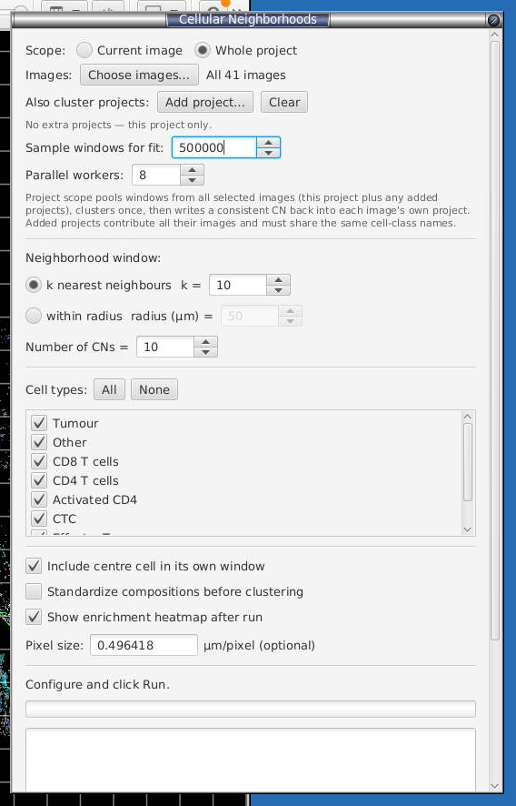

*The dialog set for a whole-project run: 41 images pooled, a 500k-window fit sample, a kNN window, 10 CNs, the cell-type checklist, and the option tick-boxes. (This screenshot pre-dates later changes; the kNN control now reads **window (cells)** and defaults to `10` — the paper's 10-cell window — and a fourth option, **Sample multiple k-means seeds**, has since been added — see §18.2.) See §18.2 for what each option does.*

1. Open **Cellular Neighborhoods…**. Pick **Scope** (and, for project scope, **Choose images…**, plus **Add project…** to pool other projects).
2. Choose the **Neighborhood window**: **k nearest neighbours** (set **window (cells)**; default `10` = a 10-cell window including the centre cell, matching the paper — see §18.2) or **within radius** (set the radius). Radius in tissue units is the more physically interpretable choice when calibrated.
3. Set **Number of CNs** (paper default 10). Fewer = coarser regions; more = finer, but expect redundancy you can merge later.
4. Tick the **Cell types** to include (**All** / **None** shortcuts). Leave out debris/ignore classes.
5. Options: **Include centre cell** (leave on to match the paper), **Standardize compositions** (see §18.2), **Sample multiple k-means seeds** (leave on for reproducible results — see §18.2), **Show enrichment heatmap after run**.
6. **Pixel size** (µm/pixel) — optional; pre-filled from the image calibration. Set it if your images are uncalibrated and you want the radius interpreted in microns.
7. For project scope, set **Sample windows for fit** and **Parallel workers**.
8. Click **Run**. The log streams progress; in project scope you'll see per-image `sampled …` then `CN assigned …` lines, interleaved across workers.

### 18.5 The enrichment heatmap — reading, naming, merging

If **Show enrichment heatmap** is on (or click **Show heatmap** later), you get the CN-by-cell-type enrichment map:

- **Rows** = CNs (with cell counts and % of all cells); **columns** = cell types.
- **Numbers** = each CN's mean composition fraction (**Show mean fractions**).
- **Colour = z-score across each row** — it highlights the type a CN is *relatively enriched* for, so a rare population lights up bright red even at a low absolute fraction. Read the colour (what defines the CN) and the number (how much of it there is) together.

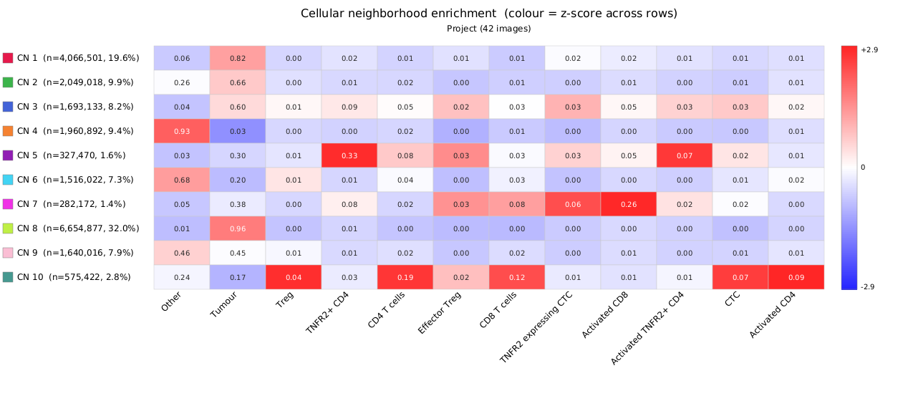

*A finished 10-CN fit across a 42-image project. This is the main **outcome** you interpret. Reading a few rows shows what you typically get: **CN 8** (32.0% of all cells, tumour fraction 0.96) and **CN 1** (19.6%, 0.82) are the tumour bulk — the large, dominant architecture. **CN 4** (0.93 "Other") is stroma/background. The small, immune-defined rows are the biology you were after: **CN 5** (1.6%) is a TNFR2⁺ CD4 niche (0.33), **CN 7** (1.4%) an activated-CD8 pocket (0.26), and **CN 10** (2.8%) a Treg / activated-CD4 mix. Notice the split of outcomes: a raw-fraction fit like this resolves the dominant tumour/stroma structure cleanly but spreads it across several near-duplicate tumour CNs (1, 2, 8, 9) — the redundancy you collapse by giving them the same name (below), or avoid by ticking **Standardize compositions** to sharpen the rare immune niches instead (§18.2).*

**Name / merge:** type a name next to each CN and click **Apply names**. This writes two things to every cell, non-destructively:

- **`CN Class`** — the **name** you typed (e.g. "tumour"), as a **text label in the cell's metadata**. QuPath measurements can only hold numbers, so the readable name lives in the metadata map, where it appears as a text column in the detection table and in cell-table exports. Empty-window cells get `Unassigned`.
- **`CN Class code`** — a numeric code (1..m) for the same grouping, which is what the **Color by: CN Class** overlay uses (a colour map needs a number).

**Giving two CNs the same name merges them** under one name and one code — the intended way to collapse the redundant CNs that a high **Number of CNs** produces (e.g. name three tumour-dominated CNs all "Tumour"). Merging only affects `CN Class` / `CN Class code`; the raw `CN` measurement keeps every original cluster id (1..k).

**Where the results are stored.** All three outputs are written per cell and are **non-destructive** — none of them touch the cell's QuPath classification (`getPathClass()`), so your trained phenotypes are untouched. They appear as columns in the detection measurement table and in cell-table exports (§[12.1](#121-cell-table-export)):

| Result | Written when | Stored as | Key | Values |
|---|---|---|---|---|
| Raw cluster id | **Run** | numeric **measurement** | `CN` | 1..k (empty-window cells = `-1`) |
| Named class (readable) | **Apply names** | text **metadata** string | `CN Class` | the name you typed (empty-window cells = `Unassigned`) |
| Named class (numeric) | **Apply names** | numeric **measurement** | `CN Class code` | 1..m (drives the *Color by: CN Class* overlay) |

> The human-readable `CN Class` lives in the cell **metadata** map (not the measurement list) because QuPath measurements can only hold numbers. In cell-table exports it comes through as a text column — make sure to tick it in the export column chooser, as metadata columns are listed after the numeric measurements.

> **Saving & scope.** In **project scope**, Apply names is **cohort-wide**: it streams every image from the run (in parallel, reusing the **Parallel workers** count), writes `CN Class` / `CN Class code` to each cell from its saved `CN` id, and **saves every image** — so the whole cohort gets consistent, named classes in one click. The open image is updated live and saved too; the log streams per-image progress. In **current-image scope** it writes to the open image only and does **not** auto-save — press **Ctrl+S** to persist.

**Export:** **Export as PNG…** saves the heatmap; **Export CN frequencies CSV…** saves the sample-by-CN frequency table — the key output for cohort analysis and for checking whether a CN's abundance tracks your biological groups (signal) or your staining batches (a batch effect to rule out).

### 18.6 Parallel workers (project scope) — performance

Both cohort passes (sample and assign) process images **in parallel**, one worker per image, controlled by the **Parallel workers** spinner (defaults to `min(8, cores − 1)`, up to your core count). Because each image is an independent read → compute → (for the assign pass) write+save, this scales close to linearly until you hit disk or memory limits.

- **Each worker loads a full image's cell hierarchy**, so higher worker counts are faster but use more memory. Dial it back on very large slides (hundreds of thousands of cells each).
- **Many small images:** raise the worker count.
- **A few very large images:** 2–4 workers is often the sweet spot.
- Results are **deterministic regardless of worker count** — each image is sampled with its own fixed seed, so the fit is reproducible run to run (and with **Sample multiple k-means seeds** on, the k-means fit itself is stabilised too — §18.2).

### 18.7 Viewer overlays

Three one-click, non-destructive recolourings drive the viewer from the last run (they map measurements via QuPath's overlay mapper; cells with `CN = -1` keep their phenotype colour):

- **Color by: Neighborhood (CN)** — a distinct, **adjacency-aware** categorical palette (spatially-touching CNs get maximally contrasting colours so regions are easy to tell apart).
- **Color by: CN Class** — colours the merged, named classes after you **Apply names** (driven by the numeric `CN Class code`).
- **Color by: diversity** — colours each cell by its neighbourhood's cell-type **Shannon diversity** (0 = one type dominates, 1 = an even mix), useful for finding mixing zones and interfaces.

Each toggle flips back to the classification colouring on a second click, and **closing the dialog automatically reverts the viewer to phenotype classifications** (so an active CN overlay never lingers and hides your classes).


*The **Color by: Neighborhood (CN)** overlay painting the whole slide by micro-environment, next to the enrichment heatmap and the **Name / merge neighborhoods** panel. The adjacency-aware palette makes the tissue architecture legible at a glance — the yellow tumour bulk, the red/blue stromal and interface bands threading between the tumour islands, and the scattered immune pockets — turning the abstract cluster ids into a map you can read against the H&E-like structure. Type names into the panel on the right and click **Apply names** to collapse the redundant CNs and drive the **Color by: CN Class** overlay.*

### 18.8 Tips & cautions

- **CN frequency varying across samples is usually the signal**, not noise — it's the per-patient readout you're after. But first rule out that it's technical: since the CN input is your phenotype labels, any **staining/batch effect in classification propagates straight into CN frequencies**. Check the frequencies CSV against your groups vs your batches.
- **Watch for CN definitions encoding sample identity** — if a CN's cells come almost entirely from one or two images, that cluster may reflect an outlier slide rather than shared biology. Sub-2% CNs are the most fragile; confirm they replicate before interpreting.
- **Run the classifier first.** CNs are only as good as the phenotypes underneath them.
- The **radius** window makes density matter (dense regions have bigger windows); **kNN** normalises for density (every window has the same fixed number of cells). Choose deliberately.

---

## 19. Tips, tricks and known limitations

- **Label at least 20–30 cells per class** before the first Train, then trust the disagreement-driven Review Mode to grow your label set efficiently.
- **Selecting cells** Hold Ctrl key on windows/linux or Command on Mac to select multiple cells at the same time to label.
- **Channel Viewer** View > Channel viewer is very useful, it will display a view of the target area which all channels selected in channel select displayed.
- **Resolve hierarchy before exporting** We also have noticed a bug where parent annotations are missing for exported cells, ContainingAnnotations will display them correctly.
- **F1 scores can lie.** A held-out 20% split is honest within an image but optimistic across the project. Always sanity-check on a few unseen slides before believing the metrics.
- **Pick different model types for Model 1 and Model 2.** Two XGBoosts won't disagree much, which kills the whole point.
- **Workers spinner caps at 8.** Each worker loads a full slide; expect ~2–4 GB RAM per worker on COMET data.
- **The marker table persists per project.** On import it's saved to `<project>/celltune/marker-table.json` and reloaded automatically when you reopen the project, so auto-channel-switching during review survives QuPath restarts — no re-import needed. (*Reset CellTune project state* clears it along with the rest of the `celltune/` folder.)
- **Project Prediction Summary needs ≥5 images** to give meaningful robust z-scores. On 2–3 image projects, treat the Anomaly column as overview or guide.
- **Composite class colours.** Without "Prepend primary", QuPath generates a colour per unique composite name — you can end up with hundreds. Tick "Prepend primary" and your existing multi-class palette is preserved.
- **No `.qpdata` save** when navigating from Project Prediction Summary — this is deliberate (saving large slides is slow and pointless for navigation). Manually save the image after editing it.

---

*Spot a missing step or an inaccurate label? Open an issue on the GitHub repo. Screenshots welcome.*
